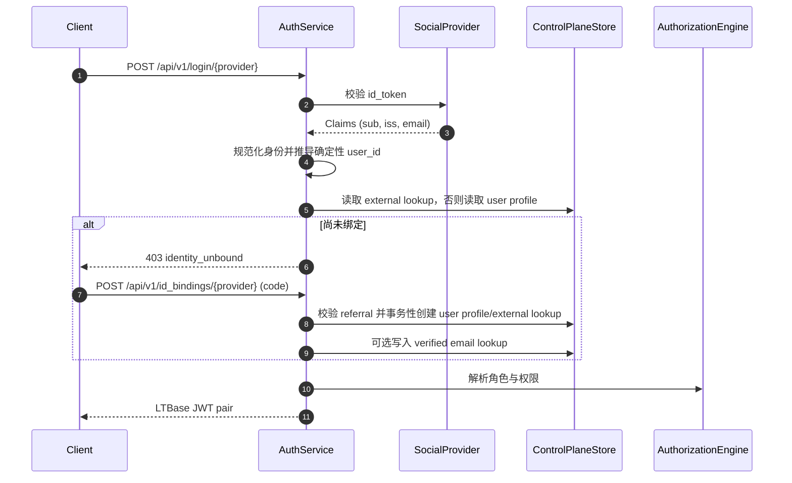

# **LTBase AAA 系统技术规范**

本文定义 **LTBase** 的完整 AAA（Authentication / Authorization / Accounting，认证 / 授权 / 审计）架构，面向社交登录场景与企业级访问控制场景。

该架构显式拆分三个关注点：

| 层 | 职责 |
| --- | --- |
| **Authentication** | 校验外部身份（社交登录 / SSO） |
| **Identity Binding** | 将外部身份映射为内部 LTBase 用户 |
| **Authorization** | 执行行级与列级权限控制 |

这种拆分使 LTBase 可以支持邀请码入驻、白名单、外部审批系统以及多项目部署，同时不削弱安全性，也不把过多状态塞进 JWT。

---

## **1. 系统概览**

LTBase AAA 系统提供：

* **Authentication**：校验外部身份并签发 JWT
* **Identity Binding**：基于策略把外部身份绑定到内部用户
* **Fine-grained Authorization**：支持行级与列/属性级访问控制
* **Audit Trails**：记录完整访问审计日志
* **AI Safety**：策略模型可安全供 AI Agent 与工具使用

授权引擎同时集成 **EntityMain + EAV 业务数据模型** 与现有 **LTBase query rule syntax**，以支持可表达的条件逻辑。

---

## **2. Authentication - Login Service（登录服务）**

### **2.1 目标**

认证层负责：

* 校验第三方身份令牌（Google / Apple / 其他）
* 规范化外部身份 claims
* 仅在身份绑定成功后签发 LTBase 会话令牌

> [!IMPORTANT]
> Authentication 本身 **不授予** 对 LTBase 资源的访问权限。只有存在有效 Identity Binding 才可以访问。

### **2.2 外部身份模型**

当前实现通过一个项目级外部身份查找记录加上确定性回退逻辑来解析外部身份：

* `project_id`
* `provider`
* `issuer`
* `sub`

Authservice 会先读取目标项目范围内的外部身份查找记录。  
如果没有查找到该记录，则推导确定性的 `user_id`，再直接读取用户档案。

| 记录类型 | 逻辑查找键 | 用途 |
| --- | --- | --- |
| External Lookup | `project_id + provider + issuer + sub` | 将外部身份解析到内部 `user_id` |
| User Profile | `project_id + user_id` | 判断该身份是否已经绑定 |

当前路径里，用户档案仍然是绑定状态的事实来源。

### **2.3 API 定义**

登录服务作为独立微服务运行，提供以下接口：

#### **POST /api/v1/login/{provider}**

把第三方身份令牌交换为 LTBase 会话令牌。

**请求头：**

| Header | Required | Description |
| --- | --- | --- |
| Authorization | Yes | `Bearer <id_token>`，由身份提供方签发，并由 API Gateway authorizer 校验 |

**请求体：**

```json
{
  "project_id": "accbd397-974e-47f2-9331-56e6c64e19ef"
}
```

| 字段 | 类型 | 必填 | 说明 |
| --- | --- | --- | --- |
| project_id | string | Yes | 认证目标项目 ID |

**响应（200 OK）：**

```json
{
  "access_token": "eyJhbGciOiJIUzI1NiIsInR5cCI6IkpXVCJ9...",
  "refresh_token": "dGhpcyBpcyBhIHJlZnJlc2ggdG9rZW4...",
  "api_base_url": "https://api.example.com"
}
```

| 字段 | 类型 | 说明 |
| --- | --- | --- |
| access_token | string | LTBase 签发的 API 访问 JWT |
| refresh_token | string | 用于换取新 access token |
| api_base_url | string | 项目级 data plane base URL |
| api_base_url | string | 项目级 data plane base URL |

**错误响应：**

| Status | `error` 值 | 说明 |
| --- | --- | --- |
| 400 | `invalid_body` | JSON body 非法 |
| 400 | `project_id_required` | body 和 claims 中都缺失 `project_id` |
| 400 | `invalid_provider` | provider 路径参数非法 |
| 400 | `missing_identity` | 缺失必要身份 claims（`sub` / `iss`） |
| 400 | `project_not_configured` | 目标项目未配置 API base URL |
| 403 | `identity_unbound` | 外部身份尚未绑定内部用户 |
| 500 | `user_lookup_failed` | 外部身份查找内部用户失败 |
| 500 | `update_last_login_failed` | 更新最近登录时间失败 |
| 500 | `role_list_failed` | 读取用户直接角色失败 |
| 500 | `role_expand_failed` | 展开继承角色失败 |
| 500 | `permission_list_failed` | 加载有效角色对应权限失败 |
| 500 | `exchange_failed` | 访问 / 刷新令牌签发失败 |

#### **POST /api/v1/id_bindings/{provider}**

为 LTBase 用户绑定第三方身份令牌。

**请求头：**

| Header | Required | Description |
| --- | --- | --- |
| Authorization | Yes | `Bearer <id_token>`，由身份提供方签发，并由 API Gateway authorizer 校验 |

**请求体：**

```json
{
  "bind_context": {
    "code": "ABC123",
    "project_id": "project_456"
  }
}
```

**响应（200 OK）：**

```json
{
  "access_token": "eyJhbGciOiJIUzI1NiIsInR5cCI6IkpXVCJ9...",
  "refresh_token": "dGhpcyBpcyBhIHJlZnJlc2ggdG9rZW4...",
  "api_base_url": "https://api.example.com"
}
```

| 字段 | 类型 | 说明 |
| --- | --- | --- |
| access_token | string | LTBase 签发的 API 访问 JWT |
| refresh_token | string | 用于换取新 access token |

**错误响应：**

| Status | `error` 值 | 说明 |
| --- | --- | --- |
| 400 | `invalid_body` | JSON body 非法 |
| 400 | `project_id_required` | 缺失 `bind_context.project_id` |
| 400 | `invalid_provider` | provider 路径参数非法 |
| 400 | `missing_identity` | 缺失必要身份 claims（`sub` / `iss`） |
| 400 | `invalid_code` | 缺失 `bind_context.code` |
| 409 | `invalid_code` | 邀请码无效、已过期或已使用 |
| 500 | `id_binding_failed` | 绑定事务或令牌签发失败 |

### **2.4 JWT 设计**

LTBase JWT：

* `sub` 使用内部 `user_id`，而不是外部 provider subject
* 不嵌入权限或绑定状态
* 令牌短期有效且保持无状态

```json
{
  "sub": "ltbase_user_id",
  "role_ids": ["Team_Android", "Dev"],
  "iat": 1700000000,
  "exp": 1700003600
}
```

> [!NOTE]
> 权限必须动态评估，以反映实时策略变化。不要把权限直接嵌入 JWT。

---

## **3. Identity Binding Layer（身份绑定层）**

### **3.1 动机**

在企业环境中：

* 不是所有 Google/Apple 用户都允许访问系统
* 访问可能依赖邀请码、邮箱域名、审批流程或外部系统
* 一个外部身份可能需要访问多个项目

因此 LTBase 在认证与授权之间引入显式的 **Identity Binding** 层。

### **3.2 内部用户（授权主体）**

内部 LTBase 用户是 **授权策略唯一使用的主体**。

用户档案作为 control-plane auth store 中的一类记录保存：

| 记录类型 | 逻辑标识 | 核心字段 |
| --- | --- | --- |
| User Profile | `project_id + user_id` | `user_id`, `project_id`, `created_at`, `last_login_at`, `provider`, `issuer`, `external_sub`, `identity_claims`, `primary_ou_id`, `report_to_user_id` |

### **3.3 身份绑定模型**

LTBase authservice 使用 **逻辑记录式 binding model**，而不是单独的 `identity_binding` 表：

| 绑定状态 | Auth Store 表示 |
| --- | --- |
| Unbound | 项目范围内不存在该确定性 `user_id` 的用户档案 |
| Bound | 存在 `project_id + user_id` 对应的用户档案 |
| Bound via code | 在同一事务中校验并消费 referral 记录，同时创建 user profile 与 external lookup（可选写入 verified email lookup） |

该设计支持：

| 能力 | 说明 |
| --- | --- |
| 多项目访问 | 一个外部身份可绑定多个项目 |
| 确定性绑定状态 | 通过确定性用户键解析绑定状态 |
| 生命周期控制 | 通过记录存在性与条件写控制绑定生命周期 |

### **3.4 登录与绑定流程**



**流程步骤：**

1. 用户通过社交 provider 登录
2. LTBase 校验外部令牌
3. Authservice 规范化身份元组并推导确定性内部 `user_id`
4. Authservice 通过确定性 `user_id` 读取用户档案
5. 如果已绑定，解析角色/权限并签发 JWT pair
6. 如果未绑定，返回 `identity_unbound`
7. 客户端使用 referral code 调用 bind 接口，原子化建立绑定

### **3.5 绑定策略模型**

绑定策略复用 LTBase rule syntax，并在 bind-time 评估：

> [!NOTE]
> 当前实现（`v1`）仍以 referral code 校验作为绑定门槛。以下策略化模型是目标设计，并且当前只在本文档层面定义契约，不再额外依赖单独的后端实现说明文档。

**邀请码策略：**

```json
{
  "l": "and",
  "c": [
    { "a": "invite.code", "v": "equals:${payload.code}" },
    { "a": "invite.status", "v": "equals:active" }
  ]
}
```

**邮箱域白名单：**

```json
{
  "l": "and",
  "c": [
    { "a": "external.email", "v": "ends_with:@company.com" }
  ]
}
```

**外部系统断言：**

```json
{
  "l": "and",
  "c": [
    { "a": "crm.customer_id", "v": "equals:${payload.customer_id}" }
  ]
}
```

---

## **4. Authorization Goals（授权目标）**

授权引擎必须保证：

* 用户只能看到有权查看的行（**row-level restriction**）
* 用户只能看到有权访问的列/属性（**column/attribute-level**）
* 策略解析或计算失败时必须 **fail-closed**
* 权限规则可引用 EAV 中的动态实体属性
* 规则必须是安全、结构化的，不能允许代码注入

> [!IMPORTANT]
> **行访问 ≠ 列可见性**，二者是不同的数据治理控制层。

### **4.1 当前运行时基线（已实现）**

当前 data-plane 执行路径采用 IAM 风格，并由 control-plane grant 记录支撑：

* Principal = 请求者 JWT 中的 `sub` + `role_ids`
* 在目标项目范围内查找 `resource_grant` 记录
* 根据 `ops` 强制校验操作（`create/read/update/delete`）
* 支持以下 selector：
  * 显式 `resource_id` grant
  * 转换为 Forma 条件的 `filter` grant
* 没有匹配 grant 时默认拒绝（fail-closed）

### **4.2 集成方向（下一层）**

在 resource grants 之上，LTBase 继续引入更丰富的权限语义：

* `permission_profile.rule_json` 用于结构化规则逻辑
* `permission_profile.outcome` 用于表达行/列动作语义（`allow_row`、`allow_column`、`mask_column` 等）
* 上下文展开（`${requester.user_id}`、`${requester.role_ids}`）只在服务端执行

---

## **5. AAA 数据模型**

### **5.1 业务实体 - EntityMain + EAV**

业务实体采用 **DSQL** 数据模型：

* **主表（`entity_main_<project_id>`）**：
  存储高频固定列，例如 `{ ltbase_schema_id, ltbase_row_id, ltbase_created_at, ltbase_updated_at, text_01...10, ... }`

* **EAV 数据表（`eav_data_<project_id>`）**：
  存储动态属性以及对应类型值列，例如 `{ schema_id, row_id, attr_id, value_text, value_numeric, ... }`

这要求授权条件针对 `eav_data` 中的属性求值，而不是仅依赖静态列。

### **5.2 授权实体**

| 记录族 | 用途 |
| --- | --- |
| `user profile` | 内部用户主体 |
| `external lookup` | 把 provider/issuer/sub 解析到 `user_id` |
| `email lookup` | 把已验证邮箱解析到 `user_id` |
| `user role` | 用户到角色映射 |
| `ou profile` | Organizational Unit 容器，带 parent 与 materialized path |
| `ou policy attachment` | 把 `policy_profile` 挂到 OU 上，并向 OU 子树继承 |
| `ou user index` | 通过主 OU 反查用户 |
| `direct report index` | 通过 manager 反查直属下属 |
| `role profile` | 角色元数据与父角色信息 |
| `role permission` | 角色到权限映射 |
| `permission profile` | 权限定义（`name`, `rule_json`, `outcome`） |
| `policy profile` | IAM 风格策略文档（`policy_document`） |
| `principal policy attachment` | 给用户/角色主体附加策略 |
| `resource grant` | 面向主体的资源操作授权（`ops`, `resource_id` / `filter`） |
| `binding policy` | 绑定阶段门禁策略（`enabled`, `priority`, `rules`） |
| `refresh session` | refresh token 生命周期 |
| `session parent-child edge` | 撤销链遍历 |
| `referral profile` | 邀请码 / referral 校验与消费状态 |
| `audit event` | 审计事件 |

权限仍然是结构化对象，而不是 EAV 记录。项目级客户端调用仍然不能直接修改权限定义。

### **5.3 实体关系**

该系统采用标准 **RBAC（Role-Based Access Control）**，并支持层级组关系；同时用 **类 Active Directory 的组织层级** 来表达组织结构：

* **User**：内部身份主体
* **Role / Group**：权限或其他角色的集合
  * Group 在语义上等价于 Role
  * **继承**：Role 可继承其他 Role（例如 `Manager` 继承 `Employee`）
  * Role 是唯一支持跨切面 / 矩阵关系的机制
* **Permission**：由 Logic Condition 与 Outcome 构成的访问规则
* **OU（Organizational Unit）**：反映汇报与归属结构的层级容器
  * 每个用户恰好属于一个 `primary_ou_id`
  * OU 通过 `parent_ou_id` 与 materialized `ou_path` 组成树
  * **OU 不是 ACL principal**。它通过挂接 `policy_profile` 间接携带授权
* **Manager**：用户档案上的单值 `report_to_user_id`，并通过 direct-report 反向索引支持“谁向谁汇报”查询

**关系流：**

1. **External Identity** 被规范化成确定性内部 `user_id`，再映射为 **User Profile**
2. **Users** 通过 `user role` 记录获得 **Roles**，并通过 `primary_ou_id` 进入一个 **OU**
3. **Roles** 通过 `role permission` 记录关联到 **Permissions**
4. **Principals** 还可直接挂接 `resource_grant` 与策略附件
5. **OUs** 可挂接 `policy_profile`，并向子树用户继承
6. **Authorization** 综合 grant 范围、角色权限与 OU 继承策略

### **5.4 逻辑 Auth Store 记录定义**

AAA 设计依赖一个逻辑 auth store contract，而不是具体物理后端。下面每种记录族都必须能按项目范围访问，并在所有受支持后端中高效满足对应访问模式。后端映射定义见 `aaa-control-plane-store-mapping.md`。

| 记录族 | 逻辑标识 / 访问模式 | 说明 |
| --- | --- | --- |
| User profile | 唯一键 `project_id + user_id` | 内部用户主体 |
| External lookup | 唯一键 `project_id + provider + issuer + sub` | provider/issuer/sub -> `user_id` |
| Verified email lookup | 唯一键 `project_id + email_lower` | 可选 |
| User-role mapping | 按 `project_id + user_id` 列表；唯一键 `project_id + user_id + role_id` | 查询用户角色 |
| OU profile | 唯一键 `project_id + ou_id` | 包含 `parent_ou_id`、`ou_path`、`name`、`block_inheritance` |
| OU user index | 按 `project_id + ou_id` 列表 | 反查 OU 下用户 |
| OU policy attachment | 按 `project_id + ou_id` 列表；唯一键 `project_id + ou_id + policy_id` | OU 上挂接策略 |
| Direct report index | 按 `project_id + manager_user_id` 列表 | 反查直属下属 |
| Role profile | 唯一键 `project_id + role_id` | 包含父角色 |
| Role-permission mapping | 按 `project_id + role_id` 列表；唯一键 `project_id + role_id + permission_id` | 查询角色权限 |
| Permission profile | 唯一键 `project_id + permission_id` | 权限载荷 |
| Policy profile | 唯一键 `project_id + policy_id` | IAM 风格策略文档 |
| Principal policy attachment | 按 `project_id + principal_type + principal_id` 列表 | 给 user/role 挂接策略 |
| Resource grant | 按 `project_id + principal_type + principal_id + schema_name` 列表 | selector 为 `resource_id` 或规范化 `filter_hash` |
| Binding policy | 按 `project_id` 列表，并按优先级排序 | bind-time 策略 |
| Referral | 唯一键 `project_id + code` | 邀请码校验与消费 |
| Refresh session | 唯一键 `project_id + refresh_jti` | 轮转 / 撤销状态 |
| Session edge | 按 `project_id + parent_jti` 列表 | 撤销链遍历 |
| Audit event | 追加写入 `project_id + event_time` | 时间有序安全日志 |

### **5.5 项目隔离策略（不依赖 SQL Views）**

项目隔离通过 **项目级记录归属** 实现，而不是 SQL views：

| 隔离控制 | 说明 |
| --- | --- |
| Project scope | 每条 auth-store 记录都且仅属于一个 `project_id` |
| Session scope | 会话记录由 `project_id` 与会话标识共同隔离 |
| Lookup discipline | 所有 authservice 读写都必须把 `project_id` 带入 repository 条件 |
| Conditional writes | 绑定 / 会话操作必须使用条件写或事务写保障安全 |

该设计避免动态 SQL view provisioning，并使 control-plane storage contract 可以跨后端移植。

### **5.6 标识规范化与编码规则**

为避免碰撞与跨语言不一致，所有标识在持久化或查找前都必须做确定性规范化：

| Segment | Rule |
| --- | --- |
| `project_id` | 使用 canonical UUID 字符串（小写、带连字符） |
| `provider` | 去首尾空格、转小写，再做 URL-safe Base64 编码（无 padding） |
| `issuer` | 去首尾空格、保留大小写，再做 URL-safe Base64 编码（无 padding） |
| `sub` | 去首尾空格，再做 URL-safe Base64 编码（无 padding） |
| `email_lower` | 去首尾空格、转小写，再做 URL-safe Base64 编码（无 padding） |
| `code` | 去首尾空格，再做 URL-safe Base64 编码（无 padding） |

通用规则：

* 所有动态标识段都按 UTF-8 处理
* 读写路径必须复用相同规范化流水线
* 如果底层后端需要额外编码，必须保证确定性，必要时可逆
* 任一规范化结果为空或非法，必须在 repository 边界快速失败

### **5.7 组织结构（Org Chart）**

LTBase 用两条彼此独立的关系来表达组织结构：

| 关系 | 字段 | 基数 | 用途 |
| --- | --- | --- | --- |
| Containment（OU） | `User.primary_ou_id` -> `OU.ou_id` | 单值 | 表示用户在组织中的归属位置，并控制策略继承 |
| Reporting line | `User.report_to_user_id` -> `User.user_id` | 单值 | 表示用户向谁汇报，并为规则提供 manager-chain 上下文 |

> [!IMPORTANT]
> 归属与汇报是 **两条独立轴线**。用户的 manager 不需要与其位于同一 OU。

#### **5.7.1 OU 树与 Materialized Path**

OU 树同时保存直接父指针 `parent_ou_id` 与 materialized `ou_path`，以支持高效子树查询：

```text
ou:rnd            parent_ou_id = null      ou_path = "/{ou_rnd}"
ou:mobiledev      parent_ou_id = ou_rnd    ou_path = "/{ou_rnd}/{ou_mobiledev}"
ou:team_android   parent_ou_id = ou_mobiledev ou_path = "/{ou_rnd}/{ou_mobiledev}/{ou_team_android}"
```

关键属性：

* `ou_path` 使用稳定 `ou_id` 片段，而不是展示名
* “查找 R&D 下所有用户”可通过 `ou_path` 前缀匹配实现，无需运行时递归展开
* 移动 OU（修改 `parent_ou_id`）时需要重写整棵子树的 `ou_path` 与 `ou_user` 反向索引，可视为后台管理操作
* 每个用户恰好一个 `primary_ou_id`；跨 OU / 矩阵关系应通过 Role 表达

#### **5.7.2 OU 策略继承（GPO 风格）**

授权只能通过 `policy_profile` 记录附着到 OU 上，具体载体为 **OU policy attachment**，逻辑标识为 `project_id + ou_id + policy_id`。

登录时，授权引擎沿用户 `primary_ou.ou_path` 从根到叶收集所有附着策略，并合并成 effective policy set。这一行为与 AD 的 GPO 继承模型一致。

> [!NOTE]
> OU 不是 `resource_grant` 或 `principal_policy_attachment` 的合法 principal。要做 OU 范围授权，应创建并挂接 `policy_profile`。

##### **继承修饰符（预留，v1 不启用）**

Schema 预留两个与 AD 对应的标志。它们可以存储，但 v1 evaluator 忽略：

| 字段 | 位置 | AD 对应概念 | 未来语义 |
| --- | --- | --- | --- |
| `block_inheritance` | OU profile | Block Inheritance | 为 true 时阻止子 OU 继承祖先策略 |
| `enforced` | OU policy attachment | Enforced / No Override | 为 true 时策略可穿透 `block_inheritance` 继续向下传播 |

#### **5.7.3 Manager 关系**

用户档案上的 `report_to_user_id` 是单值字段，指向其直属 manager。系统同时维护 direct-report 反向查找结构，以支持按 manager 快速列出直属下属。

* **仅允许单值。** 虚线汇报 / 次级 manager 不进入 schema；应通过额外 Role 表达
* **禁止环。** 写入时必须阻止用户直接或间接向自己汇报
* **链深受限。** 登录阶段展开 manager chain 时默认限制深度（例如 <= 10）

#### **5.7.4 从组织结构派生的上下文**

以下派生值在登录时（或策略刷新时）计算，并供规则求值使用：

| 变量 | 来源 | 说明 |
| --- | --- | --- |
| `${requester.primary_ou_id}` | User profile | 用户自身所属 OU |
| `${requester.ou_path}` | OU profile | 主 OU 的 materialized path |
| `${requester.ou_ancestor_ids}` | 由 `ou_path` 解析 | 所有祖先 OU（含自身） |
| `${requester.manager_chain}` | 向上遍历 `report_to_user_id` | 有界 user_id 列表，不含 requester 自身 |
| `${requester.direct_report_ids}` | 由 direct-report 反向查找得到 | 仅在规则显式引用时按需加载 |

这些值由引擎填充；客户端与 AI Agent 不能直接传入或覆盖。

---

## **6. 权限规则语法**

LTBase 当前使用两种结构化策略载荷：

1. **Permission Rule JSON (`rule_json`)**，用于 permission profiles
2. **Grant Filter (`filter`)**，用于 resource grants

### **6.1 Permission Rule JSON (`l/c/a/v`)**

Permission rules 复用 LTBase query-rule 格式：

```json
{
  "l": "and",
  "c": [
    { "a": "price", "v": "gt:10" },
    {
      "l": "or",
      "c": [
        { "a": "status", "v": "equals:active" },
        { "a": "category", "v": "starts_with:A" }
      ]
    }
  ]
}
```

| Key | 含义 |
| --- | --- |
| l | 逻辑运算符（and / or） |
| c | 条件数组 |
| a | 属性名 |
| v | 带操作符前缀的值 |

该格式支持嵌套逻辑，可用于行级与列级条件。

### **6.2 Grant Filter (`filter`)**

用于 grant-based 行范围控制时，可创建带 `filter` 的 `resource_grant` 记录：

```json
{
  "ownerUserId": "eq:${requester.user_id}",
  "status": "eq:open"
}
```

每个 key 是属性名；每个 value 是 data-plane filter parser 支持的带操作符表达式。  
不要在 `create-iam-authz-records` 请求里传 `filter_json`；control plane 会忽略该字段。持久化记录内部可暴露 `filter_json` / `filter_hash`。

---

## **7. 行级权限**

行级规则决定某个实体（row）是否可见或可操作。

当前执行路径综合：

* `resource_id` grants（显式 allow-list）
* `filter` grants（属性条件范围）

**示例：用户只能读取自己拥有的行**

```json
{
  "l": "and",
  "c": [
    { "a": "owner", "v": "equals:${requester.user_id}" }
  ]
}
```

运行时，list/read 操作会先被 grant 派生出的条件约束，再去查询业务数据。

---

## **8. 列 / 属性级权限**

列级权限控制用户在已可访问的实体上还能读取或写入哪些字段。

常见场景：

* 用户有记录访问权，但不能看全部字段
* 敏感字段需要隐藏或脱敏

**示例：只有 manager 才能读取 email 字段**

```json
{
  "l": "and",
  "c": [
    { "a": "role", "v": "equals:${requester.role_ids}" },
    { "a": "attribute_name", "v": "equals:email" }
  ]
}
```

该权限的 `outcome` 存在 permission profile 记录中，例如 `'allow_column'`、`'mask_column'`。

> [!NOTE]
> 当前实现基线仍主要覆盖行级范围控制。列级 outcome 属于集成设计的一部分，会逐步落地。

### **数据脱敏（可选）**

对敏感属性（如 SSN），可选择返回掩码值（如 `*****`），而非完全隐藏。

---

## **9. 授权引擎与求值**

### **9.1 角色展开**

有效角色需通过角色继承展开：

```text
All_Employees -> Dev -> Team_Android
```

引擎必须在评估权限前完成继承角色展开。

> [!NOTE]
> 当前实现会同时读取 JWT 中的 `role_ids` 与 auth-store `user_role` 映射，并基于 role profiles 递归展开 `parent_role_ids`。任一数据访问失败时都必须 fail-closed。

### **9.1.1 OU 祖先与策略展开**

除角色展开外，引擎还需解析用户 OU 归属链，并收集继承策略：

```text
1) 读取 user profile，得到 primary_ou_id。
2) 读取 OU profile，拆分 ou_path 得到 ou_ancestor_ids（从根到当前 OU）。
3) 对每个 ou_id，按 `project_id + ou_id` 列出 OU policy attachment。
4) 按 `project_id + policy_id` 加载 policy_profile，并合并为 effective policy set。
```

说明：

* OU 继承策略会与角色权限、主体直接附加策略一起参与评估
* `block_inheritance` 与 `enforced` 在 v1 中预留但不生效，所有祖先策略都参与合并
* OU 永远不是 resource grants 中的 principal_type

### **9.1.2 Manager Chain 解析**

引擎沿 `report_to_user_id` 向上走，填充 `${requester.manager_chain}`：

* 深度受限（默认 <= 10）以控制评估成本
* 若读取阶段发现环，应按 fail-closed 处理
* `${requester.direct_report_ids}` 仅在规则显式引用时，通过 direct-report 反向查找按需解析

### **9.2 主体范围抓取（当前基线）**

直接从 auth store 中抓取 principal grants：

```text
按 `project_id + principal_type + principal_id + schema_name`
列出 `resource_grant` 记录
```

随后评估：

* `ops` 是否兼容当前操作
* selector 是 `resource_id` 还是 `filter`

### **9.3 权限抓取（集成层）**

从全部有效角色关联的权限中抓取 permission profiles：

```text
1) 按 `project_id + role_id` 列出 `role_permission` 映射。
2) 收集去重后的 permission_id。
3) 按 `project_id + permission_id` 读取 permission profile。
```

运行时，具体后端可通过索引读取、批量读取等手段实现，并在内存中去重。

### **9.4 上下文展开**

在评估规则前，引擎将以下占位符替换为真实值：

* `${requester.user_id}`
* `${requester.role_ids}`
* `${requester.primary_ou_id}`
* `${requester.ou_path}`
* `${requester.ou_ancestor_ids}`
* `${requester.manager_chain}`
* `${requester.direct_report_ids}`（按需解析）

**示例：用户可读取自己 OU 子树内所有 owner 的记录**

```json
{ "a": "owner.ou_path", "v": "starts_with:${requester.ou_path}" }
```

**示例：manager 可读取直属下属 owner 的记录**

```json
{ "a": "owner.user_id", "v": "in:${requester.direct_report_ids}" }
```

### **9.5 条件求值**

规则逻辑（`l/c`）针对以下数据求值：

* 目标实体的 EAV 属性（行级规则）
* 当前访问的属性名（列级规则）

**示例：**

```json
{ "a": "project_team", "v": "equals:${requester.role_ids}" }
```

表示判断请求者角色中是否包含该项目所属 team。

未解析的占位符或非法策略表达式必须 fail-closed。

---

## **10. 查询过滤与执行**

当前 data-plane 会把 grant 派生的条件下推到 Forma query conditions。

对于 SQL-native 路径，可使用等价的 CTE（Common Table Expression）模式来实现：

```sql
WITH matched_entities AS (
    SELECT DISTINCT e.row_id
    FROM public.eav_data e
    WHERE e.schema_id = $1
      AND (
          EXISTS (SELECT 1 FROM public.eav_data x WHERE x.row_id = e.row_id AND x.attr_id = ... AND ...)
      )
)
SELECT t.*
FROM public.entity_main t
JOIN matched_entities m ON t.ltbase_row_id = m.row_id;
```

列 / 属性过滤则根据 permission outcomes 决定字段是否返回或做 masking。

---

## **11. AI Agent 安全性**

为防止 prompt injection 与意外提权：

* 权限必须静态定义在策略存储中
* Agent 可以请求数据，但 **不能贡献策略逻辑**
* 规则求值必须是确定且安全的
* `${...}` 变量只允许在服务端展开
* 非法策略载荷默认拒绝（fail-closed）

这保证 Agent 永远只是请求动作，而不是生成实际策略条件。

---

## **12. 审计与记账**

与授权相关的决策应被记录：

| 字段 | 用途 |
| --- | --- |
| timestamp | 发生时间 |
| user_id | 请求者（内部用户） |
| action | 尝试执行的操作 |
| resource | 实体类型 / ID |
| decision | allowed / denied |
| details | 命中的规则、上下文值 |

Audit events 作为 auth-store 里的项目级审计日志追加写入。底层存储必须支持按 `(timestamp, tie_breaker)` 稳定排序，以便做审计查询、导出与事故分析。

> [!NOTE]
> 当前实现已通过 control-plane store 记录 authservice audit events。data-plane 授权决策审计会逐步对齐到同一模型。

---

## **13. 总结**

LTBase AAA 框架：

* 清晰拆分 **Authentication**、**Identity Binding**、**Authorization**
* 支持仅依赖社交登录的企业级入驻模型
* 提供面向邀请、白名单、审批流的 **policy-driven identity binding**
* 当前基线采用 fail-closed 的 **grant-based row enforcement**
* 继续扩展到 permission-profile 驱动的 **row/column outcomes**
* 同时支持 grant filters 与 LTBase rule syntax
* 支持层级角色展开，并综合 role/user principal
* 以接近 Active Directory 的方式表达组织结构与策略继承
* 确保 AI Agent 安全
* 生成完整审计轨迹

该设计使 LTBase 能作为 **AI-native、enterprise-ready 的 BaaS 平台** 演进。
