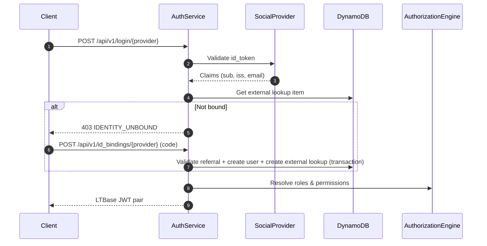

# **LTBase AAA System — Technical Specification**

This document defines the **complete Authentication, Authorization, and Accounting (AAA)** architecture for **LTBase**, designed for both social login environments and enterprise-grade access control requirements.

The architecture explicitly separates three concerns:

| Layer                | Responsibility                                  |
| -------------------- | ----------------------------------------------- |
| **Authentication**   | Verify external identity via social login / SSO |
| **Identity Binding** | Map external identity to internal LTBase user   |
| **Authorization**    | Enforce row-level and column-level permissions  |

This separation enables LTBase to support invitation-based onboarding, whitelists, external approval systems, and multi-project deployments — without weakening security or overloading JWTs.

---

## **1. System Overview**

The LTBase AAA system provides:

* **Authentication** — External identity verification and JWT token issuance
* **Identity Binding** — Maps external identities to internal users using policy-driven rules
* **Fine-grained Authorization** — Enforces access at row-level and column/attribute-level
* **Audit Trails** — Complete logging of all access events
* **AI Safety** — Policy model safe for usage by AI Agents and tools

The authorization engine integrates with both **EntityMain + EAV business data** and the existing **LTBase query rule syntax** for expressive condition logic.

---

## **2. Authentication — Login Service**

### **2.1 Purpose**

The authentication layer is responsible for:

* Validating third-party identity tokens (Google / Apple / etc.)
* Normalizing external identity claims
* Issuing LTBase session tokens **only after identity binding succeeds**

> [!IMPORTANT]
> Authentication alone does **not** grant access to LTBase resources. An active Identity Binding is required.

### **2.2 External Identity Model**

External identity lookup is stored in a **shared DynamoDB table** (same table used by control plane), using project-scoped keys:

| Item Type | Key Pattern | Purpose |
| --------- | ----------- | ------- |
| External Identity Lookup | `PK: auth#project#{project_id}#ext#{provider_b64}#{issuer_b64}#{sub_b64}`<br>`SK: user` | Resolve external identity to internal user |

Typical attributes include `user_id`, `provider`, `issuer`, `external_sub`, `email`, and `updated_at`.

This item represents **who the user is according to the external provider**, and which internal user it is bound to.

### **2.3 API Definition**

The Login Service runs as an **independent microservice** with the following endpoints:

#### **POST /api/v1/login/{provider}**

Exchange a third-party identity token for an LTBase session token.

**Request Headers:**

| Header        | Required | Description                                                                            |
| ------------- | -------- | -------------------------------------------------------------------------------------- |
| Authorization | Yes      | `Bearer <id_token>` — JWT from identity provider (validated by API Gateway authorizer) |

**Request Body:**

```json
{
  "project_id": "accbd397-974e-47f2-9331-56e6c64e19ef"
}
```

| Field      | Type   | Required | Description                          |
| ---------- | ------ | -------- | ------------------------------------ |
| project_id | string | Yes      | Target project ID for authentication |

**Response (200 OK):**

```json
{
  "access_token": "eyJhbGciOiJIUzI1NiIsInR5cCI6IkpXVCJ9...",
  "refresh_token": "dGhpcyBpcyBhIHJlZnJlc2ggdG9rZW4...",
  "api_base_url": "https://api.example.com"
}
```

| Field         | Type   | Description                           |
| ------------- | ------ | ------------------------------------- |
| access_token  | string | LTBase signed JWT for API access      |
| refresh_token | string | Token for obtaining new access tokens |
| expires_at    | number | Access token expiry (Unix seconds)    |
| project_id    | string | Effective project ID                  |
| api_base_url  | string | Project-scoped data plane base URL    |

**Error Responses:**

| Status | `error` Value              | Description                                          |
| ------ | -------------------------- | ---------------------------------------------------- |
| 400    | `invalid_body`             | Malformed JSON body                                  |
| 400    | `project_id_required`      | `project_id` missing in body and claims              |
| 400    | `invalid_provider`         | Provider path parameter is invalid                   |
| 400    | `missing_identity`         | Missing required identity claims (`sub`/`iss`)       |
| 400    | `project_not_configured`   | No API base URL configured for the target project    |
| 403    | `identity_unbound`         | External identity is not bound to an internal user   |
| 500    | `user_lookup_failed`       | Failed to lookup user by external identity           |
| 500    | `update_last_login_failed` | Failed to update user login timestamp                |
| 500    | `role_list_failed`         | Failed to load direct user roles                     |
| 500    | `role_expand_failed`       | Failed to expand inherited roles                     |
| 500    | `permission_list_failed`   | Failed to load permissions from effective roles      |
| 500    | `exchange_failed`          | Failed to issue access/refresh token pair            |

#### **POST /api/v1/id_bindings/{provider}**

Bind a third-party identity token for an LTBase user.

**Request Headers:**

| Header        | Required | Description                                                                            |
| ------------- | -------- | -------------------------------------------------------------------------------------- |
| Authorization | Yes      | `Bearer <id_token>` — JWT from identity provider (validated by API Gateway authorizer) |

**Request Body:** 

```json
{
  "bind_context": {
    "code": "ABC123",
    "project_id": "project_456"
  }
}
```

**Response (200 OK):**

```json
{
  "access_token": "eyJhbGciOiJIUzI1NiIsInR5cCI6IkpXVCJ9...",
  "refresh_token": "dGhpcyBpcyBhIHJlZnJlc2ggdG9rZW4...",
  "api_base_url": "https://api.example.com"
}
```

| Field         | Type   | Description                           |
| ------------- | ------ | ------------------------------------- |
| access_token  | string | LTBase signed JWT for API access      |
| refresh_token | string | Token for obtaining new access tokens |

**Error Responses:**

| Status | `error` Value         | Description                                       |
| ------ | --------------------- | ------------------------------------------------- |
| 400    | `invalid_body`        | Malformed JSON body                               |
| 400    | `project_id_required` | `bind_context.project_id` is missing              |
| 400    | `invalid_provider`    | Provider path parameter is invalid                |
| 400    | `missing_identity`    | Missing required identity claims (`sub`/`iss`)    |
| 400    | `invalid_code`        | `bind_context.code` is missing                    |
| 409    | `invalid_code`        | Referral code invalid, expired, or already used   |
| 500    | `id_binding_failed`   | Binding transaction or token issuance failed       |


### **2.4 JWT Design**

LTBase JWTs:

* Use **internal user_id** as `sub` (not external provider subject)
* Never include permissions or binding state
* Are short-lived and stateless

```json
{
  "sub": "ltbase_user_id",
  "role_ids": ["Team_Android", "Dev"],
  "iat": 1700000000,
  "exp": 1700003600
}
```

> [!NOTE]
> Permissions must be evaluated dynamically to reflect real-time policy changes. Do not embed permissions in JWT.

---

## **3. Identity Binding Layer**

### **3.1 Motivation**

In enterprise environments:

* Not every Google/Apple user is allowed to access the system
* Access may depend on invitation codes, email domains, approvals, or external systems
* One external identity may need access to multiple projects

Therefore, LTBase introduces an explicit **Identity Binding** layer between authentication and authorization.

### **3.2 Internal User (Authorization Subject)**

The internal LTBase user is the **only subject used by authorization policies**.

User profile is stored as a DynamoDB item:

| Item Type | Key Pattern | Core Attributes |
| --------- | ----------- | --------------- |
| User Profile | `PK: auth#project#{project_id}#user#{user_id}`<br>`SK: profile` | `user_id`, `project_id`, `email`, `email_verified`, `created_at`, `last_login_at`, `provider`, `issuer`, `external_sub` |

### **3.3 Identity Binding Schema**

LTBase authservice uses an **item-based binding model** instead of a dedicated `identity_binding` table:

| Binding State | DynamoDB Representation |
| ------------- | ----------------------- |
| Unbound | No external lookup item for `(project_id, provider, issuer, sub)` |
| Bound | External lookup item exists and points to a valid user profile |
| Bound via code | Referral item validated + consumed in the same transaction that creates user/binding |

This design enables:

| Capability                  | Description                                             |
| --------------------------- | ------------------------------------------------------- |
| Multi-project access        | One external identity → multiple projects               |
| Multiple identity providers | One internal user → multiple external identities        |
| Lifecycle control           | Binding is controlled through item existence and conditional writes |

### **3.4 Login & Binding Flow**



**Flow Steps:**

1. User logs in via social provider
2. LTBase validates the external token
3. Authservice looks up external binding in DynamoDB
4. If bound → resolve roles/permissions and issue JWT pair
5. If not bound → return `IDENTITY_UNBOUND`
6. Client calls bind endpoint with referral code to create binding atomically

### **3.5 Binding Policy Model**

Binding policies reuse LTBase rule syntax and are evaluated at bind-time:

> [!NOTE]
> Current implementation (`v1`) uses referral-code validation as the binding gate.
> The policy-driven model below is the target design.
> Detailed implementation guidance is documented in `aaa-binding-policy-implementation.md`.

**Invitation Code Policy:**

```json
{
  "l": "and",
  "c": [
    { "a": "invite.code", "v": "equals:${payload.code}" },
    { "a": "invite.status", "v": "equals:active" }
  ]
}
```

**Email Domain Whitelist:**

```json
{
  "l": "and",
  "c": [
    { "a": "external.email", "v": "ends_with:@company.com" }
  ]
}
```

**External System Assertion:**

```json
{
  "l": "and",
  "c": [
    { "a": "crm.customer_id", "v": "equals:${payload.customer_id}" }
  ]
}
```

---

## **4. Authorization Goals**

The authorization engine must ensure:

* A user only sees rows they are permitted to see (**row-level restriction**)
* A user only sees columns/attributes they are allowed to (**column/attribute-level**)
* Permission rules can reference dynamic entity attributes in EAV
* Rules are safe and structured (no code injection)

> [!IMPORTANT]
> **Row access ≠ Column visibility** — both are distinct control layers for data governance and compliance.

---

## **5. AAA Data Model**

### **5.1 Business Entities — EntityMain + EAV**

Business entities use the **DSQL** based data model:

* **Primary Table (`entity_main_<project_id>`):**
  Stores high-frequency fixed columns: `{ ltbase_schema_id, ltbase_row_id, ltbase_created_at, ltbase_updated_at, text_01...10, ... }`

* **EAV Data Table (`eav_data_<project_id>`):**
  Stores dynamic attributes with typed value columns: `{ schema_id, row_id, attr_id, value_text, value_numeric, ... }`

This dynamic attribute model requires authorization conditions that match attributes from `eav_data` (mapping `attr_name` to `attr_id` and using `value_text`/`value_numeric`) rather than static columns.

### **5.2 Authorization Entities**

| Item Family | Purpose |
| ----------- | ------- |
| `user profile` | Internal user identity subject |
| `external lookup` | Resolve `(project, provider, issuer, sub)` to `user_id` |
| `email lookup` | Resolve verified email to `user_id` |
| `user role` | User → role mapping |
| `role profile` | Role metadata and parent role (inheritance) |
| `role permission` | Role → permission mapping |
| `permission profile` | Permission definition (`name`, `rule_json`, `outcome`) |
| `refresh session` | Refresh token lifecycle (issued/rotated/revoked) |
| `session parent-child edge` | Revoke-chain traversal |
| `referral profile` | Invite/referral validation and consume state |
| `audit event` | Accounting and security audit trail |

Permissions remain structured objects, not EAV records. Project-scoped client calls still cannot mutate permission definitions directly.

### **5.3 Entity Relationships**

The system follows a standard **RBAC (Role-Based Access Control)** model with support for hierarchical groups:

* **User**: The internal identity principal
* **Role / Group**: Represents a collection of permissions or other roles
  * Groups are functionally equivalent to Roles
  * **Inheritance**: A Role can inherit from another Role (e.g., `Manager` inherits `Employee`)
* **Permission**: A specific access rule composed of a Logic Condition and an Outcome

**Relationship Flow:**

1. **External Identity** is bound to **Internal User** (via `external lookup` item)
2. **Users** are assigned **Roles** (via `user role` items)
3. **Roles** are mapped to **Permissions** (via `role permission` items)
4. **Permissions** define the actual policies

### **5.4 DynamoDB Single-Table Key Definitions**

Identity records are stored in the shared physical table with project-scoped key namespaces:

| Domain | `PK` Pattern | `SK` Pattern | Notes |
| ------ | ------------ | ------------ | ----- |
| User profile | `auth#project#{project_id}#user#{user_id}` | `profile` | Internal user principal |
| External identity lookup | `auth#project#{project_id}#ext#{provider_b64}#{issuer_b64}#{sub_b64}` | `user` | Identity binding lookup |
| Verified email lookup | `auth#project#{project_id}#email#{email_lower_b64}` | `user` | Optional/conditional |
| User-role mapping | `auth#project#{project_id}#user#{user_id}` | `role#{role_id}` | Query roles by user |
| Role profile | `auth#project#{project_id}#role#{role_id}` | `profile` | Includes parent role |
| Role-permission mapping | `auth#project#{project_id}#role#{role_id}` | `permission#{permission_id}` | Query permissions by role |
| Permission profile | `auth#project#{project_id}#permission#{permission_id}` | `profile` | Permission payload |
| Binding policy | `auth#project#{project_id}#binding_policy` | `profile#{policy_id}` | Query-enabled policy loading |
| Refresh session | `auth#project#{project_id}#session#{refresh_jti}` | `profile` | Rotation/revocation state |
| Session edge | `auth#project#{project_id}#session_parent#{parent_jti}` | `child#{refresh_jti}` | Revoke-chain traversal |
| Referral | `auth#project#{project_id}#ref#{code_b64}` | `profile` | Invite validation/consumption |
| Audit event | `auth#project#{project_id}#audit` | `ts#{unix_ms}#{rand}` | Time-ordered append log |

### **5.5 Project Isolation Strategy (No SQL Views)**

Project isolation is implemented by **key scoping**, not SQL views:

| Isolation Control | Description |
| ----------------- | ----------- |
| Key namespace | Every auth item is prefixed with `auth#project#{project_id}` |
| Lookup discipline | All authservice reads/writes include project-scoped keys |
| Conditional writes | Binding/session operations use conditional or transactional writes for safety |

This design removes dynamic SQL view provisioning and keeps authservice storage serverless-native.

### **5.6 Key Normalization and Encoding Rules**

To avoid key collisions and cross-language inconsistencies, key segments must be normalized deterministically:

| Segment | Rule |
| ------- | ---- |
| `project_id` | Use canonical UUID string form (lowercase, hyphenated). |
| `provider` | Trim spaces, lowercase, then encode with Base64 URL-safe (no padding). |
| `issuer` | Trim spaces, keep original case, encode with Base64 URL-safe (no padding). |
| `sub` | Trim spaces, encode with Base64 URL-safe (no padding). |
| `email_lower` | Trim spaces, lowercase, then encode with Base64 URL-safe (no padding). |
| `code` | Trim spaces, encode with Base64 URL-safe (no padding). |

General rules:

* All dynamic key segments are UTF-8 strings.
* Do not use raw delimiters (`#`) inside key segments; always encode dynamic segments.
* The same normalization pipeline must be shared by read and write paths.
* Any invalid or empty normalized segment must fail fast at repository boundary.

---

## **6. Permission Rule Syntax**

Policy rules use the existing LTBase query rule format:

```json
{
  "l": "and",
  "c": [
    { "a": "price", "v": "gt:10" },
    {
      "l": "or",
      "c": [
        { "a": "status", "v": "equals:active" },
        { "a": "category", "v": "starts_with:A" }
      ]
    }
  ]
}
```

| Key | Meaning                     |
| --- | --------------------------- |
| l   | Logical operator (and / or) |
| c   | Condition array             |
| a   | Attribute name              |
| v   | Value with operator prefix  |

This format supports nested logic and serves both row-level and column-level conditions.

---

## **7. Row-Level Permission**

A row-level rule determines whether a given entity (row) is visible or actionable.

**Example — User can read only rows they own:**

```json
{
  "l": "and",
  "c": [
    { "a": "owner", "v": "equals:${requester.user_id}" }
  ]
}
```

Row-level access control restricts visibility to specific dataset rows based on attributes or roles.

---

## **8. Column / Attribute-Level Permission**

Column-level permission controls *which attributes of an entity* a user may read or write.

Use cases:

* A user has access to a record but not all its fields
* Sensitive fields should be masked or hidden

**Example — Allow reading email only for managers:**

```json
{
  "l": "and",
  "c": [
    { "a": "role", "v": "equals:${requester.role_ids}" },
    { "a": "attribute_name", "v": "equals:email" }
  ]
}
```

The `outcome` for this permission would be stored as `'allow_column'` in the permission profile item.

### **Data Masking (Optional)**

For sensitive attributes (e.g., SSN), you may choose to *mask the value* (e.g., replace with `*****`) instead of hiding it completely. This is akin to dynamic data masking in database systems.

---

## **9. Authorization Engine & Evaluation**

### **9.1 Role Expansion**

Compute effective roles by resolving hierarchy:

```
All_Employees → Dev → Team_Android
```

The engine must expand inherited roles before evaluating permissions.

### **9.2 Permission Fetch**

Fetch permissions associated with all effective roles:

```text
1) Query each role partition:
   PK: auth#project#{project_id}#role#{role_id}
   SK begins_with "permission#"

2) Collect unique permission_id values.

3) Get each permission profile:
   PK: auth#project#{project_id}#permission#{permission_id}
   SK: profile
```

At runtime, this is implemented with DynamoDB `Query` + `GetItem`/batch read patterns, then de-duplicated in memory.

### **9.3 Context Expansion**

Before evaluating a rule, the engine replaces placeholders:

* `${requester.user_id}`
* `${requester.role_ids}`

with real values.

### **9.4 Condition Evaluation**

The rule logic (l/c) is evaluated against:

* EAV attributes of the target entity (row-level rules)
* The attribute names being accessed (column-level rules)

**Example:**

```json
{ "a": "project_team", "v": "equals:${requester.role_ids}" }
```

evaluates whether the requester's roles include the team of the project.

---

## **10. Query Filtering & Enforcement**

To enforce permissions on list queries, use the **CTE (Common Table Expression)** pattern:

```sql
WITH matched_entities AS (
    SELECT DISTINCT e.row_id
    FROM public.eav_data e
    WHERE e.schema_id = $1
      AND (
          -- Recursive logic generated from permission rules
          EXISTS (SELECT 1 FROM public.eav_data x WHERE x.row_id = e.row_id AND x.attr_id = ... AND ...)
      )
)
SELECT t.*
FROM public.entity_main t
JOIN matched_entities m ON t.ltbase_row_id = m.row_id;
```

Column/attribute filters involve checking which fields should be returned or masked.

---

## **11. AI Agent Safety**

To defend against prompt injection and unintended privilege escalation:

* Permissions must be **defined statically in policy storage**
* Agents may request data but **cannot contribute policy logic**
* Rule evaluation must be deterministic and safe
* Variables like `${…}` are expanded only server-side

This ensures that agents *never generate policy conditions* but only request actions against enforced policies.

---

## **12. Accounting & Auditing**

All enforcement decisions are logged:

| Field     | Purpose                       |
| --------- | ----------------------------- |
| timestamp | When check happened           |
| user_id   | Who requested (internal user) |
| action    | Operation attempted           |
| resource  | Entity type / ID              |
| decision  | allowed / denied              |
| details   | Rule matched, context values  |

Audit events are appended as DynamoDB items under:

* `PK: auth#project#{project_id}#audit`
* `SK: ts#{unix_ms}#{rand}`

This supports compliance and incident investigation.

---

## **13. Summary**

The LTBase AAA framework:

* Cleanly separates **Authentication**, **Identity Binding**, and **Authorization**
* Supports enterprise onboarding models with social login only
* Provides **policy-driven identity binding** for invitations, whitelists, and approvals
* Enforces both **row-level** and **column/attribute-level** permissions
* Integrates permission evaluation with EAV business data
* Reuses existing LTBase logic rule syntax for all policies
* Expands roles hierarchically
* Ensures AI agent safety
* Generates complete audit trails

This design positions LTBase as an **AI-native, enterprise-ready BaaS platform**.
