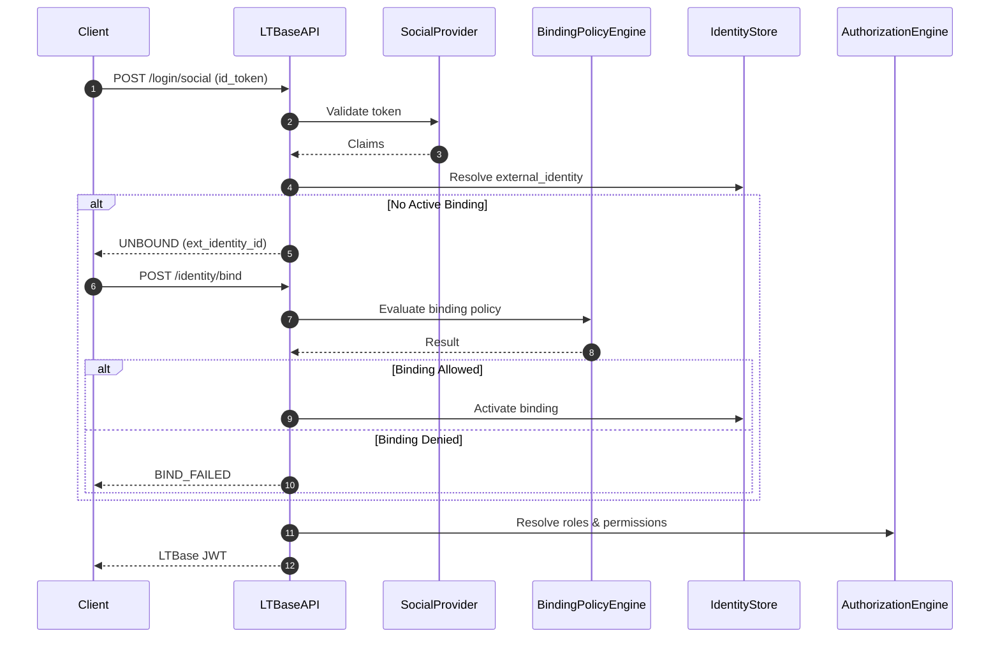

# **LTBase AAA System — Technical Specification**

This document defines the **complete Authentication, Authorization, and Accounting (AAA)** architecture for **LTBase**, designed for both social login environments and enterprise-grade access control requirements.

The architecture explicitly separates three concerns:

| Layer                | Responsibility                                  |
| -------------------- | ----------------------------------------------- |
| **Authentication**   | Verify external identity via social login / SSO |
| **Identity Binding** | Map external identity to internal LTBase user   |
| **Authorization**    | Enforce row-level and column-level permissions  |

This separation enables LTBase to support invitation-based onboarding, whitelists, external approval systems, and multi-tenant deployments — without weakening security or overloading JWTs.

---

## **1. System Overview**

The LTBase AAA system provides:

* **Authentication** — External identity verification and JWT token issuance
* **Identity Binding** — Maps external identities to internal users using policy-driven rules
* **Fine-grained Authorization** — Enforces access at row-level and column/attribute-level
* **Audit Trails** — Complete logging of all access events
* **AI Safety** — Policy model safe for usage by AI Agents and tools

The authorization engine integrates with both **EntityMain + EAV business data** and the existing **LTBase query rule syntax** for expressive condition logic.

---

## **2. Authentication — Login Service**

### **2.1 Purpose**

The authentication layer is responsible for:

* Validating third-party identity tokens (Google / Apple / etc.)
* Normalizing external identity claims
* Issuing LTBase session tokens **only after identity binding succeeds**

> [!IMPORTANT]
> Authentication alone does **not** grant access to LTBase resources. An active Identity Binding is required.

### **2.2 External Identity Model**

External identities are stored independently from LTBase internal users:

```sql
CREATE TABLE identity.external_identity (
    ext_id UUID PRIMARY KEY DEFAULT gen_random_uuid(),
    project_id UUID NOT NULL,
    provider TEXT NOT NULL,              -- google, apple, etc
    provider_subject TEXT NOT NULL,      -- external `sub`
    email TEXT,
    raw_claims JSONB,
    created_at BIGINT NOT NULL,
    UNIQUE (project_id, provider, provider_subject)
);
```

This table represents **who the user is according to the external provider**, nothing more.

### **2.3 API Definition**

The Login Service runs as an **independent microservice** with the following endpoints:

#### **POST /api/v1/login/{provider}**

Exchange a third-party identity token for an LTBase session token.

**Request Headers:**

| Header        | Required | Description                                                                            |
| ------------- | -------- | -------------------------------------------------------------------------------------- |
| Authorization | Yes      | `Bearer <id_token>` — JWT from identity provider (validated by API Gateway authorizer) |

**Request Body:**

```json
{
  "project_id": "accbd397-974e-47f2-9331-56e6c64e19ef"
}
```

| Field      | Type   | Required | Description                          |
| ---------- | ------ | -------- | ------------------------------------ |
| project_id | string | Yes      | Target project ID for authentication |

**Response (200 OK):**

```json
{
  "access_token": "eyJhbGciOiJIUzI1NiIsInR5cCI6IkpXVCJ9...",
  "refresh_token": "dGhpcyBpcyBhIHJlZnJlc2ggdG9rZW4..."
}
```

| Field         | Type   | Description                           |
| ------------- | ------ | ------------------------------------- |
| access_token  | string | LTBase signed JWT for API access      |
| refresh_token | string | Token for obtaining new access tokens |

**Error Responses:**

| Status | Code                | Description                                         |
| ------ | ------------------- | --------------------------------------------------- |
| 400    | INVALID_REQUEST     | Missing or malformed fields                         |
| 401    | INVALID_TOKEN       | Token verification failed                           |
| 403    | IDENTITY_UNBOUND    | External identity not bound to user (see Section 3) |

#### **POST /api/v1/id_bindings/{provider}**

Bind a third-party identity token for an LTBase user.

**Request Headers:**

| Header        | Required | Description                                                                            |
| ------------- | -------- | -------------------------------------------------------------------------------------- |
| Authorization | Yes      | `Bearer <id_token>` — JWT from identity provider (validated by API Gateway authorizer) |

**Request Body:** 

```json
{
  "bind_context": {
    "code": "ABC123",
    "project_id": "project_456"
  }
}
```

**Response (200 OK):**

```json
{
  "access_token": "eyJhbGciOiJIUzI1NiIsInR5cCI6IkpXVCJ9...",
  "refresh_token": "dGhpcyBpcyBhIHJlZnJlc2ggdG9rZW4..."
}
```

| Field         | Type   | Description                           |
| ------------- | ------ | ------------------------------------- |
| access_token  | string | LTBase signed JWT for API access      |
| refresh_token | string | Token for obtaining new access tokens |

**Error Responses:**

| Status | Code            | Description                          |
| ------ | --------------- | ------------------------------------ |
| 400    | INVALID_REQUEST | Missing or malformed fields          |
| 401    | INVALID_TOKEN   | Token verification failed            |
| 409    | INVALID_CODE    | Code is invalid or it has been used. |


### **2.4 JWT Design**

LTBase JWTs:

* Use **internal user_id** as `sub` (not external provider subject)
* Never include permissions or binding state
* Are short-lived and stateless

```json
{
  "sub": "ltbase_user_id",
  "role_ids": ["Team_Android", "Dev"],
  "iat": 1700000000,
  "exp": 1700003600
}
```

> [!NOTE]
> Permissions must be evaluated dynamically to reflect real-time policy changes. Do not embed permissions in JWT.

---

## **3. Identity Binding Layer**

### **3.1 Motivation**

In enterprise environments:

* Not every Google/Apple user is allowed to access the system
* Access may depend on invitation codes, email domains, approvals, or external systems
* One external identity may need access to multiple tenants/workspaces

Therefore, LTBase introduces an explicit **Identity Binding** layer between authentication and authorization.

### **3.2 Internal User (Authorization Subject)**

The internal LTBase user is the **only subject used by authorization policies**:

```sql
CREATE TABLE identity.user (
    user_id UUID PRIMARY KEY DEFAULT gen_random_uuid(),
    project_id UUID NOT NULL,
    username TEXT NOT NULL,
    email TEXT,
    created_at BIGINT NOT NULL,
    UNIQUE (project_id, username)
);
```

### **3.3 Identity Binding Schema**

```sql
CREATE TABLE identity.identity_binding (
    binding_id UUID PRIMARY KEY DEFAULT gen_random_uuid(),
    project_id UUID NOT NULL,

    tenant_id UUID NOT NULL,
    workspace_id UUID NOT NULL,

    ext_id UUID REFERENCES identity.external_identity(ext_id),
    user_id UUID REFERENCES identity.user(user_id),

    status TEXT NOT NULL,                -- pending | active | suspended | revoked
    bind_context JSONB,                  -- invite code, approver, external IDs

    created_at BIGINT NOT NULL,
    activated_at BIGINT,

    UNIQUE (project_id, tenant_id, workspace_id, ext_id)
);
```

This design enables:

| Capability                  | Description                                             |
| --------------------------- | ------------------------------------------------------- |
| Multi-tenant access         | One external identity → multiple tenants/workspaces     |
| Multiple identity providers | One internal user → multiple external identities        |
| Lifecycle control           | Explicit status management (pending → active → revoked) |

### **3.4 Login & Binding Flow**



**Flow Steps:**

1. User logs in via social provider
2. LTBase validates the external token
3. LTBase resolves or creates `external_identity`
4. LTBase checks for an **active identity binding**
5. If bound → issue LTBase JWT
6. If not bound → return `UNBOUND` response, client must request binding

### **3.5 Binding Policy Model**

Binding policies reuse LTBase rule syntax and are evaluated at bind-time:

**Invitation Code Policy:**

```json
{
  "l": "and",
  "c": [
    { "a": "invite.code", "v": "equals:${payload.code}" },
    { "a": "invite.status", "v": "equals:active" }
  ]
}
```

**Email Domain Whitelist:**

```json
{
  "l": "and",
  "c": [
    { "a": "external.email", "v": "ends_with:@company.com" }
  ]
}
```

**External System Assertion:**

```json
{
  "l": "and",
  "c": [
    { "a": "crm.customer_id", "v": "equals:${payload.customer_id}" }
  ]
}
```

---

## **4. Authorization Goals**

The authorization engine must ensure:

* A user only sees rows they are permitted to see (**row-level restriction**)
* A user only sees columns/attributes they are allowed to (**column/attribute-level**)
* Permission rules can reference dynamic entity attributes in EAV
* Rules are safe and structured (no code injection)

> [!IMPORTANT]
> **Row access ≠ Column visibility** — both are distinct control layers for data governance and compliance.

---

## **5. AAA Data Model**

### **5.1 Business Entities — EntityMain + EAV**

Business entities use the **DSQL** based data model:

* **Primary Table (`entity_main_<project_id>`):**
  Stores high-frequency fixed columns: `{ ltbase_schema_id, ltbase_row_id, ltbase_created_at, ltbase_updated_at, text_01...10, ... }`

* **EAV Data Table (`eav_data_<project_id>`):**
  Stores dynamic attributes with typed value columns: `{ schema_id, row_id, attr_id, value_text, value_numeric, ... }`

This dynamic attribute model requires authorization conditions that match attributes from `eav_data` (mapping `attr_name` to `attr_id` and using `value_text`/`value_numeric`) rather than static columns.

### **5.2 Authorization Entities**

| Entity                     | Purpose                         |
| -------------------------- | ------------------------------- |
| identity.user              | User identity (internal)        |
| identity.external_identity | External provider identity      |
| identity.identity_binding  | External → Internal mapping     |
| identity.role              | Role / group (with inheritance) |
| identity.user_role         | User → Roles                    |
| identity.permission        | Permission definition           |
| identity.role_permission   | Roles → Permissions             |
| audit.log                  | Audit/Accounting                |

**Permissions are stored in structured tables**, not EAV. Tenant has no API to modify permissions. Only admin console or control plane APIs can modify permissions.

### **5.3 Entity Relationships**

The system follows a standard **RBAC (Role-Based Access Control)** model with support for hierarchical groups:

* **User**: The internal identity principal
* **Role / Group**: Represents a collection of permissions or other roles
  * Groups are functionally equivalent to Roles
  * **Inheritance**: A Role can inherit from another Role (e.g., `Manager` inherits `Employee`)
* **Permission**: A specific access rule composed of a Logic Condition and an Outcome

**Relationship Flow:**

1. **External Identity** is bound to **Internal User** (via `identity.identity_binding`)
2. **Users** are assigned **Roles** (Many-to-Many via `identity.user_role`)
3. **Roles** are mapped to **Permissions** (Many-to-Many via `identity.role_permission`)
4. **Permissions** define the actual policies

### **5.4 SQL Definitions**

```sql
CREATE SCHEMA identity;

-- 1. Users (Internal)
CREATE TABLE identity.user (
    user_id UUID PRIMARY KEY DEFAULT gen_random_uuid(),
    project_id UUID NOT NULL,
    username TEXT NOT NULL,
    email TEXT,
    created_at BIGINT NOT NULL,
    UNIQUE (project_id, username)
);

-- 2. External Identities
CREATE TABLE identity.external_identity (
    ext_id UUID PRIMARY KEY DEFAULT gen_random_uuid(),
    project_id UUID NOT NULL,
    provider TEXT NOT NULL,
    provider_subject TEXT NOT NULL,
    email TEXT,
    raw_claims JSONB,
    created_at BIGINT NOT NULL,
    UNIQUE (project_id, provider, provider_subject)
);

-- 3. Identity Binding
CREATE TABLE identity.identity_binding (
    binding_id UUID PRIMARY KEY DEFAULT gen_random_uuid(),
    project_id UUID NOT NULL,
    ext_id UUID REFERENCES identity.external_identity(ext_id),
    user_id UUID REFERENCES identity.user(user_id),
    status TEXT NOT NULL,
    bind_context JSONB,
    created_at BIGINT NOT NULL,
    activated_at BIGINT,
    UNIQUE (project_id, ext_id)
);

-- 4. Roles (and Groups)
CREATE TABLE identity.role (
    role_id UUID PRIMARY KEY DEFAULT gen_random_uuid(),
    project_id UUID NOT NULL,
    name TEXT NOT NULL,
    description TEXT,
    parent_role_id UUID REFERENCES identity.role(role_id),
    created_at BIGINT NOT NULL,
    UNIQUE (project_id, name)
);

-- 5. Permissions
CREATE TABLE identity.permission (
    permission_id UUID PRIMARY KEY DEFAULT gen_random_uuid(),
    project_id UUID NOT NULL,
    name TEXT NOT NULL,
    rule_json JSONB NOT NULL,
    outcome TEXT NOT NULL,
    description TEXT,
    created_at BIGINT NOT NULL,
    UNIQUE (project_id, name)
);

-- 6. User -> Role Mapping
CREATE TABLE identity.user_role (
    user_id UUID REFERENCES identity.user(user_id),
    role_id UUID REFERENCES identity.role(role_id),
    assigned_at BIGINT NOT NULL,
    PRIMARY KEY (user_id, role_id)
);

-- 7. Role -> Permission Mapping
CREATE TABLE identity.role_permission (
    role_id UUID REFERENCES identity.role(role_id),
    permission_id UUID REFERENCES identity.permission(permission_id),
    PRIMARY KEY (role_id, permission_id)
);
```

### **5.5 Per-Project Views**

Each project gets its own set of views that filter data to only that project. Views are created dynamically when a project is provisioned, using the naming convention `<table_name>_<project_id>`:

```sql
-- Template: Views for project {project_id}

-- User view
CREATE VIEW identity.user_{project_id} WITH (security_barrier = true) AS
    SELECT user_id, username, email, created_at
    FROM identity.user
    WHERE project_id = '{project_id}';

-- External Identity view
CREATE VIEW identity.external_identity_{project_id} WITH (security_barrier = true) AS
    SELECT ext_id, provider, provider_subject, email, raw_claims, created_at
    FROM identity.external_identity
    WHERE project_id = '{project_id}';

-- Identity Binding view
CREATE VIEW identity.identity_binding_{project_id} WITH (security_barrier = true) AS
    SELECT binding_id, ext_id, user_id, status, bind_context, created_at, activated_at
    FROM identity.identity_binding
WHERE project_id = '{project_id}';

-- Role view
CREATE VIEW identity.role_{project_id} WITH (security_barrier = true) AS
    SELECT role_id, name, description, parent_role_id, created_at
    FROM identity.role
    WHERE project_id = '{project_id}';

-- Permission view
CREATE VIEW identity.permission_{project_id} WITH (security_barrier = true) AS
    SELECT permission_id, name, rule_json, outcome, description, created_at
    FROM identity.permission
WHERE project_id = '{project_id}';

-- User-Role mapping view (joined through user)
CREATE VIEW identity.user_role_{project_id} WITH (security_barrier = true) AS
    SELECT ur.user_id, ur.role_id, ur.assigned_at
    FROM identity.user_role ur
    JOIN identity.user u ON ur.user_id = u.user_id
    WHERE u.project_id = '{project_id}';

-- Role-Permission mapping view (joined through role)
CREATE VIEW identity.role_permission_{project_id} WITH (security_barrier = true) AS
    SELECT rp.role_id, rp.permission_id
    FROM identity.role_permission rp
    JOIN identity.role r ON rp.role_id = r.role_id
WHERE r.project_id = '{project_id}';
```

**Benefits:**

| Benefit            | Description                                                           |
| ------------------ | --------------------------------------------------------------------- |
| Tenant Isolation   | Each project only sees its own data through dedicated views           |
| Simplified Queries | Application code queries views without filtering by `project_id`      |
| Permission Control | GRANT/REVOKE can be applied per-view to limit tenant access           |
| Schema Consistency | Views expose the same columns (minus `project_id`) across all tenants |

**Permission Example:**

```sql
-- Grant read-only access to a specific project's views
GRANT SELECT ON identity.user_{project_id} TO project_reader_role;
GRANT SELECT ON identity.role_{project_id} TO project_reader_role;
GRANT SELECT ON identity.permission_{project_id} TO project_reader_role;
```

---

## **6. Permission Rule Syntax**

Policy rules use the existing LTBase query rule format:

```json
{
  "l": "and",
  "c": [
    { "a": "price", "v": "gt:10" },
    {
      "l": "or",
      "c": [
        { "a": "status", "v": "equals:active" },
        { "a": "category", "v": "starts_with:A" }
      ]
    }
  ]
}
```

| Key | Meaning                     |
| --- | --------------------------- |
| l   | Logical operator (and / or) |
| c   | Condition array             |
| a   | Attribute name              |
| v   | Value with operator prefix  |

This format supports nested logic and serves both row-level and column-level conditions.

---

## **7. Row-Level Permission**

A row-level rule determines whether a given entity (row) is visible or actionable.

**Example — User can read only rows they own:**

```json
{
  "l": "and",
  "c": [
    { "a": "owner", "v": "equals:${requester.user_id}" }
  ]
}
```

Row-level access control restricts visibility to specific dataset rows based on attributes or roles.

---

## **8. Column / Attribute-Level Permission**

Column-level permission controls *which attributes of an entity* a user may read or write.

Use cases:

* A user has access to a record but not all its fields
* Sensitive fields should be masked or hidden

**Example — Allow reading email only for managers:**

```json
{
  "l": "and",
  "c": [
    { "a": "role", "v": "equals:${requester.role_ids}" },
    { "a": "attribute_name", "v": "equals:email" }
  ]
}
```

The `outcome` for this permission would be stored as `'allow_column'` in the `identity.permission` table.

### **Data Masking (Optional)**

For sensitive attributes (e.g., SSN), you may choose to *mask the value* (e.g., replace with `*****`) instead of hiding it completely. This is akin to dynamic data masking in database systems.

---

## **9. Authorization Engine & Evaluation**

### **9.1 Role Expansion**

Compute effective roles by resolving hierarchy:

```
All_Employees → Dev → Team_Android
```

The engine must expand inherited roles before evaluating permissions.

### **9.2 Permission Fetch**

Fetch permissions associated with all effective roles:

```sql
SELECT p.*
FROM identity.permission p
JOIN identity.role_permission rp ON p.permission_id = rp.permission_id
WHERE rp.role_id IN (:role_ids)
```

### **9.3 Context Expansion**

Before evaluating a rule, the engine replaces placeholders:

* `${requester.user_id}`
* `${requester.role_ids}`

with real values.

### **9.4 Condition Evaluation**

The rule logic (l/c) is evaluated against:

* EAV attributes of the target entity (row-level rules)
* The attribute names being accessed (column-level rules)

**Example:**

```json
{ "a": "project_team", "v": "equals:${requester.role_ids}" }
```

evaluates whether the requester's roles include the team of the project.

---

## **10. Query Filtering & Enforcement**

To enforce permissions on list queries, use the **CTE (Common Table Expression)** pattern:

```sql
WITH matched_entities AS (
    SELECT DISTINCT e.row_id
    FROM public.eav_data e
    WHERE e.schema_id = $1
      AND (
          -- Recursive logic generated from permission rules
          EXISTS (SELECT 1 FROM public.eav_data x WHERE x.row_id = e.row_id AND x.attr_id = ... AND ...)
      )
)
SELECT t.*
FROM public.entity_main t
JOIN matched_entities m ON t.ltbase_row_id = m.row_id;
```

Column/attribute filters involve checking which fields should be returned or masked.

---

## **11. AI Agent Safety**

To defend against prompt injection and unintended privilege escalation:

* Permissions must be **defined statically in policy storage**
* Agents may request data but **cannot contribute policy logic**
* Rule evaluation must be deterministic and safe
* Variables like `${…}` are expanded only server-side

This ensures that agents *never generate policy conditions* but only request actions against enforced policies.

---

## **12. Accounting & Auditing**

All enforcement decisions are logged:

| Field     | Purpose                       |
| --------- | ----------------------------- |
| timestamp | When check happened           |
| user_id   | Who requested (internal user) |
| action    | Operation attempted           |
| resource  | Entity type / ID              |
| decision  | allowed / denied              |
| details   | Rule matched, context values  |

This supports compliance and incident investigation.

---

## **13. Summary**

The LTBase AAA framework:

* Cleanly separates **Authentication**, **Identity Binding**, and **Authorization**
* Supports enterprise onboarding models with social login only
* Provides **policy-driven identity binding** for invitations, whitelists, and approvals
* Enforces both **row-level** and **column/attribute-level** permissions
* Integrates permission evaluation with EAV business data
* Reuses existing LTBase logic rule syntax for all policies
* Expands roles hierarchically
* Ensures AI agent safety
* Generates complete audit trails

This design positions LTBase as an **AI-native, enterprise-ready BaaS platform**.
