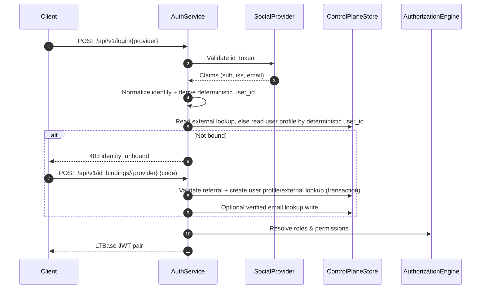

# LTBase AAA System — Technical Specification

This document defines the Authentication, Authorization, and Accounting (AAA) architecture for LTBase, covering both social login environments and enterprise access control requirements.

The architecture explicitly separates three concerns:

| Layer                | Responsibility                                  |
| -------------------- | ----------------------------------------------- |
| **Authentication**   | Verify external identity via social login / SSO |
| **Identity Binding** | Map external identity to internal LTBase user   |
| **Authorization**    | Enforce row-level and column-level permissions  |

This separation lets LTBase support invitation-based onboarding, whitelists, external approval systems, and multi-project deployments without weakening security or overloading JWTs.

---

## 1. System Overview

The LTBase AAA system provides:

* Authentication: external identity verification and JWT token issuance
* Identity Binding: maps external identities to internal users using policy-driven rules
* Fine-grained authorization: enforces access at row-level and column/attribute-level
* Audit trails: logging of all access events
* AI safety: policy model safe for usage by AI Agents and tools

The authorization engine integrates with both EntityMain + EAV business data and the existing LTBase query rule syntax for condition logic.

---

## 2. Authentication — Login Service

### 2.1 Purpose

The authentication layer is responsible for:

* Validating third-party identity tokens (Google / Apple / etc.)
* Normalizing external identity claims
* Issuing LTBase session tokens **only after identity binding succeeds**

> [!IMPORTANT]
> Authentication alone does **not** grant access to LTBase resources. An active Identity Binding is required.

### 2.2 External Identity Model

Current implementation resolves external identity by combining a project-scoped lookup record with a deterministic fallback:

* `project_id`
* `provider`
* `issuer`
* `sub`

Authservice first tries an external lookup record scoped to the target project.  
If no lookup record exists, it derives deterministic `user_id` and reads the user profile directly.

| Record Type | Logical Lookup Key | Purpose |
| ----------- | ------------------ | ------- |
| External Lookup | `project_id + provider + issuer + sub` | Resolve external identity to internal `user_id` |
| User Profile | `project_id + user_id` | Resolve whether identity is already bound |

The user profile remains the source of truth for binding state in the current path.

### 2.3 API Definition

The Login Service runs as an independent microservice with the following endpoints:

#### POST /api/v1/login/{provider}

Exchange a third-party identity token for an LTBase session token.

**Request Headers:**

| Header        | Required | Description                                                                            |
| ------------- | -------- | -------------------------------------------------------------------------------------- |
| Authorization | Yes      | `Bearer <id_token>` — JWT from identity provider (validated by API Gateway authorizer) |

**Request Body:**

```json
{
  "project_id": "accbd397-974e-47f2-9331-56e6c64e19ef"
}
```

| Field      | Type   | Required | Description                          |
| ---------- | ------ | -------- | ------------------------------------ |
| project_id | string | Yes      | Target project ID for authentication |

**Response (200 OK):**

```json
{
  "access_token": "eyJhbGciOiJIUzI1NiIsInR5cCI6IkpXVCJ9...",
  "refresh_token": "dGhpcyBpcyBhIHJlZnJlc2ggdG9rZW4...",
  "api_base_url": "https://api.example.com"
}
```

| Field         | Type   | Description                           |
| ------------- | ------ | ------------------------------------- |
| access_token  | string | LTBase signed JWT for API access      |
| refresh_token | string | Token for obtaining new access tokens |
| api_base_url  | string | Project-scoped data plane base URL    |

**Error Responses:**

| Status | `error` Value              | Description                                          |
| ------ | -------------------------- | ---------------------------------------------------- |
| 400    | `invalid_body`             | Malformed JSON body                                  |
| 400    | `project_id_required`      | `project_id` missing in body and claims              |
| 400    | `invalid_provider`         | Provider path parameter is invalid                   |
| 400    | `missing_identity`         | Missing required identity claims (`sub`/`iss`)       |
| 400    | `project_not_configured`   | No API base URL configured for the target project    |
| 403    | `identity_unbound`         | External identity is not bound to an internal user   |
| 500    | `user_lookup_failed`       | Failed to lookup user by external identity           |
| 500    | `update_last_login_failed` | Failed to update user login timestamp                |
| 500    | `role_list_failed`         | Failed to load direct user roles                     |
| 500    | `role_expand_failed`       | Failed to expand inherited roles                     |
| 500    | `permission_list_failed`   | Failed to load permissions from effective roles      |
| 500    | `exchange_failed`          | Failed to issue access/refresh token pair            |

#### POST /api/v1/id_bindings/{provider}

Bind a third-party identity token for an LTBase user.

**Request Headers:**

| Header        | Required | Description                                                                            |
| ------------- | -------- | -------------------------------------------------------------------------------------- |
| Authorization | Yes      | `Bearer <id_token>` — JWT from identity provider (validated by API Gateway authorizer) |

**Request Body:** 

```json
{
  "bind_context": {
    "code": "ABC123",
    "project_id": "project_456"
  }
}
```

**Response (200 OK):**

```json
{
  "access_token": "eyJhbGciOiJIUzI1NiIsInR5cCI6IkpXVCJ9...",
  "refresh_token": "dGhpcyBpcyBhIHJlZnJlc2ggdG9rZW4...",
  "api_base_url": "https://api.example.com"
}
```

| Field         | Type   | Description                           |
| ------------- | ------ | ------------------------------------- |
| access_token  | string | LTBase signed JWT for API access      |
| refresh_token | string | Token for obtaining new access tokens |
| api_base_url  | string | Project-scoped data plane base URL    |

**Error Responses:**

| Status | `error` Value         | Description                                       |
| ------ | --------------------- | ------------------------------------------------- |
| 400    | `invalid_body`        | Malformed JSON body                               |
| 400    | `project_id_required` | `bind_context.project_id` is missing              |
| 400    | `invalid_provider`    | Provider path parameter is invalid                |
| 400    | `missing_identity`    | Missing required identity claims (`sub`/`iss`)    |
| 400    | `invalid_code`        | `bind_context.code` is missing                    |
| 409    | `invalid_code`        | Referral code invalid, expired, or already used   |
| 500    | `id_binding_failed`   | Binding transaction or token issuance failed       |


### 2.4 JWT Design

LTBase JWTs:

* Use internal user_id as `sub` (not external provider subject)
* Never include permissions or binding state
* Are short-lived and stateless

```json
{
  "sub": "ltbase_user_id",
  "role_ids": ["Team_Android", "Dev"],
  "iat": 1700000000,
  "exp": 1700003600
}
```

> [!NOTE]
> Permissions must be evaluated dynamically to reflect real-time policy changes. Do not embed permissions in JWT.

---

## 3. Identity Binding Layer

### 3.1 Motivation

In enterprise environments:

* Not every Google/Apple user is allowed to access the system
* Access may depend on invitation codes, email domains, approvals, or external systems
* One external identity may need access to multiple projects

Therefore, LTBase introduces an explicit Identity Binding layer between authentication and authorization.

### 3.2 Internal User (Authorization Subject)

The internal LTBase user is the only subject used by authorization policies.

User profile is stored as a control-plane auth-store record:

| Record Type | Logical Identity | Core Attributes |
| ----------- | ---------------- | --------------- |
| User Profile | `project_id + user_id` | `user_id`, `project_id`, `created_at`, `last_login_at`, `provider`, `issuer`, `external_sub`, `identity_claims`, `primary_ou_id`, `report_to_user_id` |

### 3.3 Identity Binding Schema

LTBase authservice uses a logical-record binding model instead of a dedicated `identity_binding` table:

| Binding State | Auth Store Representation |
| ------------- | ------------------------- |
| Unbound | No user profile record exists at deterministic `user_id` within the project scope |
| Bound | User profile record exists for `project_id + user_id` |
| Bound via code | Referral record is validated and consumed in the same transaction that creates the user profile and external lookup (optional verified-email lookup may also be written) |

This design supports:

| Capability                  | Description                                             |
| --------------------------- | ------------------------------------------------------- |
| Multi-project access        | One external identity → multiple projects               |
| Deterministic binding state | Binding state is resolved through deterministic user key |
| Lifecycle control           | Binding is controlled through record existence and conditional writes |

### 3.4 Login & Binding Flow


```mermaid
sequenceDiagram
    autonumber
    participant Client
    participant AuthService
    participant SocialProvider
    participant ControlPlaneStore
    participant AuthorizationEngine

    Client->>AuthService: POST /api/v1/login/{provider}
    AuthService->>SocialProvider: Validate id_token
    SocialProvider-->>AuthService: Claims (sub, iss, email)

    AuthService->>AuthService: Normalize identity + derive deterministic user_id
    AuthService->>ControlPlaneStore: Read external lookup, else read user profile by deterministic user_id

    alt Not bound
        AuthService-->>Client: 403 identity_unbound
        Client->>AuthService: POST /api/v1/id_bindings/{provider} (code)
        AuthService->>ControlPlaneStore: Validate referral + create user profile/external lookup (transaction)
        AuthService->>ControlPlaneStore: Optional verified email lookup write
    end

    AuthService->>AuthorizationEngine: Resolve roles & permissions
    AuthService-->>Client: LTBase JWT pair
```

**Flow Steps:**

1. User logs in via social provider
2. LTBase validates the external token
3. Authservice normalizes identity tuple and derives deterministic internal `user_id`
4. Authservice reads user profile by deterministic `user_id`
5. If bound → resolve roles/permissions and issue JWT pair
6. If not bound → return `identity_unbound`
7. Client calls bind endpoint with referral code to create binding atomically

### 3.5 Binding Policy Model

Binding policies reuse LTBase rule syntax and are evaluated at bind-time:

> [!NOTE]
> Current implementation (`v1`) uses referral-code validation as the binding gate.
> The policy-driven model below is the target design and is intentionally specified here at the contract level rather than as a separate backend-specific implementation document.

**Invitation Code Policy:**

```json
{
  "l": "and",
  "c": [
    { "a": "invite.code", "v": "equals:${payload.code}" },
    { "a": "invite.status", "v": "equals:active" }
  ]
}
```

**Email Domain Whitelist:**

```json
{
  "l": "and",
  "c": [
    { "a": "external.email", "v": "ends_with:@company.com" }
  ]
}
```

**External System Assertion:**

```json
{
  "l": "and",
  "c": [
    { "a": "crm.customer_id", "v": "equals:${payload.customer_id}" }
  ]
}
```

---

## 4. Authorization Goals

The authorization engine must ensure:

* A user only sees rows they are permitted to see (row-level restriction)
* A user only sees columns/attributes they are allowed to (column/attribute-level)
* Runtime policy is fail-closed when policy resolution/evaluation fails
* Policy statements can reference dynamic entity attributes in EAV and `${requester.*}` context
* Rules are safe and structured (no code injection)

> [!IMPORTANT]
> **Row access ≠ Column visibility**: both are distinct control layers for data governance and compliance.

### 4.1 Unified Policy Model

All authorization is expressed through a single concept, `policy_profile`, which holds one or more `statement` items. A statement carries:

* `effect`: `allow` / `deny` / `mask`
* `ops`: set of operations (`create` / `read` / `update` / `delete`, or `*` for all)
* `schema`: entity scope
* `selector`: row scope (`resource_id` list, `filter`, or both)
* `outcome`: optional column-level annotation (which attrs, what action)
* `condition`: optional `l/c/a/v` rule, evaluated against entity attributes and `${requester.*}` context

Policies are attached to principals (`user`, `role`) and to `OU` containers; OU attachments inherit down the OU subtree (see 5.7.2). The same evaluator processes all three attachment surfaces, with deny-overrides and mask-overrides-allow precedence (see 9.6).

> [!NOTE]
> Earlier drafts of this document carried three parallel authorization mechanisms: `resource_grant`, `permission_profile`, and `policy_profile`. They have been folded into the unified statement model above. `resource_grant` survives only as a possible physical projection (see 4.2), not as a separate logical concept.
>
> For the canonical definition of each legacy term, the full migration mapping, and the JWT `permissions` claim compatibility contract, see `policy-permission-relationship.md`.

### 4.2 Physical Optimizations

The auth store may maintain denormalized projections of single-statement policies as a runtime optimization, for example a `resource_grant`-style index for hot-path `resource_id` / `filter` lookups. These projections are caches of the unified policy model and must reflect the same effective decisions as evaluating the full statement set.

---

## 5. AAA Data Model

### 5.1 Business Entities — EntityMain + EAV

Business entities use the DSQL based data model:

* Primary table (`entity_main_<project_id>`):
  Stores high-frequency fixed columns: `{ ltbase_schema_id, ltbase_row_id, ltbase_created_at, ltbase_updated_at, text_01...10, ... }`

* EAV data table (`eav_data_<project_id>`):
  Stores dynamic attributes with typed value columns: `{ schema_id, row_id, attr_id, value_text, value_numeric, ... }`

This dynamic attribute model requires authorization conditions that match attributes from `eav_data` (mapping `attr_name` to `attr_id` and using `value_text`/`value_numeric`) rather than static columns.

### 5.2 Authorization Entities

| Record Family | Purpose |
| ------------- | ------- |
| `user profile` | Internal user identity subject |
| `external lookup` | Resolve provider/issuer/sub to `user_id` |
| `email lookup` | Resolve verified email to `user_id` |
| `user role` | User → role mapping |
| `ou profile` | Organizational Unit container with parent and materialized path |
| `ou policy attachment` | Attach `policy_profile` to an OU; inherits to OU subtree (GPO-style) |
| `ou user index` | Reverse index: list users by primary OU |
| `direct report index` | Reverse index: list direct reports by manager |
| `role profile` | Role metadata and parent role (inheritance) |
| `policy profile` | Authorization policy: one or more `statement` items (allow / deny / mask) — see §6 |
| `principal policy attachment` | Attach policy to principal (user / role) |
| `binding policy` | Bind-time gating policy (`enabled`, `priority`, `rules`) |
| `refresh session` | Refresh token lifecycle (issued/rotated/revoked) |
| `session parent-child edge` | Revoke-chain traversal |
| `referral profile` | Invite/referral validation and consume state |
| `audit event` | Accounting and security audit trail |

Policies remain structured objects, not EAV records. Project-scoped client calls go through the control-plane authz API; they cannot mutate policy documents through the data-plane EAV path.

### 5.3 Entity Relationships

The system follows a standard RBAC (Role-Based Access Control) model with support for hierarchical groups, plus an Active Directory-style organizational hierarchy for org-chart modeling:

* **User**: The internal identity principal
* **Role / Group**: A named bundle of policy attachments and a node in the role-inheritance graph
  * Groups are functionally equivalent to Roles
  * Inheritance: a Role can inherit from another Role (e.g., `Manager` inherits `Employee`)
  * Roles are the **only** vehicle for cross-cutting / matrix membership (a user can hold many roles)
* **Policy**: A named container of one or more `statement` items. Statements carry `effect` (allow / deny / mask), `ops`, `schema`, optional `selector` and `outcome`, and optional `condition` (see §6).
* **OU (Organizational Unit)**: Hierarchical container reflecting reporting structure
  * Each user has exactly one `primary_ou_id` (AD-faithful single containment)
  * OUs form a tree via `parent_ou_id` and a materialized `ou_path`
  * **OUs are not ACL principals.** They carry authorization indirectly by attaching `policy_profile` items, which inherit down the OU subtree (analogous to AD Group Policy)
* **Manager**: Single-valued `report_to_user_id` on each user; reverse `direct_report` index supports "who reports to X" queries. Dotted-line / matrix reporting is modeled with Roles, not with additional manager edges.

Relationship flow:

1. External identity is normalized to a deterministic internal `user_id`, then mapped to a user profile
2. Users are assigned roles (via `user role` items) and placed in exactly one OU (via `primary_ou_id`)
3. Policies may be attached to users, roles, or OUs via the corresponding attachment records
4. OU policy attachments inherit down the OU subtree along `ou_path`
5. Authorization evaluates the union of policies reachable through user-direct, role (with role inheritance), and OU-ancestor attachments, combining statements per the precedence rules in §9.6

### 5.4 Logical Auth Store Record Definitions

The AAA design depends on a logical auth store contract, not a specific physical backend. Each record family below must be addressable by project scope and must support the listed access pattern efficiently in all supported backends. Backend-specific mappings are documented in `aaa-control-plane-store-mapping.md`.

| Record Family | Logical Identity / Access Pattern | Notes |
| ------------- | --------------------------------- | ----- |
| User profile | Unique by `project_id + user_id` | Internal user principal |
| External lookup | Unique by `project_id + provider + issuer + sub` | Provider/issuer/sub -> `user_id` |
| Verified email lookup | Unique by `project_id + email_lower` | Optional/conditional |
| User-role mapping | List by `project_id + user_id`; unique by `project_id + user_id + role_id` | Query roles by user |
| OU profile | Unique by `project_id + ou_id` | Includes `parent_ou_id`, `ou_path`, `name`, `block_inheritance` |
| OU user index | List by `project_id + ou_id` | Reverse lookup for users in an OU |
| OU policy attachment | List by `project_id + ou_id`; unique by `project_id + ou_id + policy_id` | Attach `policy_profile` to OU |
| Direct report index | List by `project_id + manager_user_id` | Reverse lookup of `report_to_user_id` |
| Role profile | Unique by `project_id + role_id` | Includes parent role |
| Policy profile | Unique by `project_id + policy_id` | Document with one or more `statement` items (see §6) |
| Principal policy attachment | List by `project_id + principal_type + principal_id` | Attach policy to user/role principal |
| Binding policy | List by `project_id` and sort by priority | Bind-time policy loading |
| Referral | Unique by `project_id + code` | Invite validation/consumption |
| Refresh session | Unique by `project_id + refresh_jti` | Rotation/revocation state |
| Session edge | List by `project_id + parent_jti` | Revoke-chain traversal |
| Audit event | Append-only by `project_id + event_time` | Time-ordered security log |

### 5.5 Project Isolation Strategy (No SQL Views)

Project isolation is implemented by project-scoped record ownership, not SQL views:

| Isolation Control | Description |
| ----------------- | ----------- |
| Project scope | Every auth-store record belongs to exactly one `project_id` |
| Session scope | Runtime sessions are isolated by `project_id` and session identifiers |
| Lookup discipline | All authservice reads/writes include `project_id` in repository criteria |
| Conditional writes | Binding/session operations use conditional or transactional writes for safety |

This design avoids dynamic SQL view provisioning and keeps the control-plane storage contract portable across backends.

### 5.6 Identifier Normalization and Encoding Rules

To avoid collisions and cross-language inconsistencies, identifiers must be normalized deterministically before they are persisted or used in lookups:

| Segment | Rule |
| ------- | ---- |
| `project_id` | Use canonical UUID string form (lowercase, hyphenated). |
| `provider` | Trim spaces, lowercase, then encode with Base64 URL-safe (no padding). |
| `issuer` | Trim spaces, keep original case, encode with Base64 URL-safe (no padding). |
| `sub` | Trim spaces, encode with Base64 URL-safe (no padding). |
| `email_lower` | Trim spaces, lowercase, then encode with Base64 URL-safe (no padding). |
| `code` | Trim spaces, encode with Base64 URL-safe (no padding). |

General rules:

* All dynamic identifier segments are UTF-8 strings.
* The same normalization pipeline must be shared by read and write paths.
* Any backend-specific encoding must be deterministic and reversible where needed.
* Any invalid or empty normalized segment must fail fast at repository boundary.

### 5.7 Organization Structure (Org Chart)

LTBase models organizational structure with two independent relationships, following Microsoft Active Directory:

| Relationship | Field | Cardinality | Purpose |
| ------------ | ----- | ----------- | ------- |
| Containment (OU) | `User.primary_ou_id` → `OU.ou_id` | Single-valued | Reflects where the user *sits* in the org chart; controls policy inheritance |
| Reporting line | `User.report_to_user_id` → `User.user_id` | Single-valued | Reflects who the user *reports to*; enables manager-chain context in rules |

> [!IMPORTANT]
> Containment and reporting are **independent** axes. A user's manager need not sit in the same OU (e.g., functional manager in a different OU). Authorization rules can reference either or both.

> [!NOTE]
> "Org chart" is the concept; the data model is org units (`org_units` / OU). For the REST/JSON/action names of org units and the other built-in resources, see `API-specs-control-plane.en.md` §3.4 (Built-in Resources).

#### 5.7.1 OU Tree and Materialized Path

The OU tree is encoded with both a direct `parent_ou_id` pointer and a materialized `ou_path` for efficient subtree queries:

```
ou:rnd            parent_ou_id = null      ou_path = "/{ou_rnd}"
ou:mobiledev      parent_ou_id = ou_rnd    ou_path = "/{ou_rnd}/{ou_mobiledev}"
ou:team_android   parent_ou_id = ou_mobiledev ou_path = "/{ou_rnd}/{ou_mobiledev}/{ou_team_android}"
```

Key properties:

* `ou_path` is built from stable `ou_id` segments, not display names, so renaming an OU does not invalidate the path.
* "All users under R&D" becomes a `begins_with` predicate on `ou_path`, with no recursive expansion at query time.
* Moving an OU (changing `parent_ou_id`) requires rewriting `ou_path` and `ou_user` index entries for the entire subtree. This is treated as an administrative operation and may be applied asynchronously.
* Each user has exactly one `primary_ou_id`. Cross-OU / matrix membership is not modeled on the OU axis; it is expressed by assigning the user additional Roles.

#### 5.7.2 OU Policy Inheritance (GPO-Style)

Authorization is attached to OUs only through `policy_profile` records, via an OU policy attachment record identified by `project_id + ou_id + policy_id`.

At login, the authorization engine walks the user's `primary_ou.ou_path` from root to leaf and unions all attached policies into the effective policy set. This mirrors AD's GPO inheritance model: a policy attached at `R&D` automatically applies to every user under `R&D/MobileDev/Team_Android` without per-OU duplication.

> [!NOTE]
> OUs are **not** valid principals for `resource_grant` records or `principal_policy_attachment`. To grant something OU-wide, create (or pick) a `policy_profile` and attach it via `ou_policy`. Ad-hoc `policy_profile` instances may be created from the admin UI in a future version when an OU needs a one-off policy.

##### Inheritance Modifiers (Reserved, v1 Disabled)

The schema reserves two AD-equivalent flags. They are accepted in storage but ignored by the v1 evaluator; precedence rules will be specified before they are enabled.

| Field | Location | AD Equivalent | Future Semantics |
| ----- | -------- | ------------- | ---------------- |
| `block_inheritance` | OU profile | "Block Inheritance" | When true, an OU stops inheriting policies from its ancestors |
| `enforced` | OU policy attachment | "Enforced / No Override" | When true, a policy continues to flow downward even past a `block_inheritance` child |

#### 5.7.3 Manager Relationship

The `report_to_user_id` attribute on a user profile is a single-valued pointer to that user's direct manager. The system maintains a direct-report reverse lookup for fast listing by manager.

* Single-valued only. Dotted-line / secondary managers are deliberately not modeled in the schema; express them with a dedicated Role (e.g., `Project_X_DottedReport`).
* Cycle prevention is enforced at write time: a user cannot directly or transitively report to themselves.
* Chain depth is bounded (default ≤ 10) when expanding the manager chain at login, to keep authorization context size predictable.

#### 5.7.4 Effective Context From the Org Chart

These derived values are computed at login (or on policy refresh) and made available to rule evaluation:

| Variable | Source | Notes |
| -------- | ------ | ----- |
| `${requester.primary_ou_id}` | User profile | The user's own OU |
| `${requester.ou_path}` | OU profile | Materialized path of the primary OU |
| `${requester.ou_ancestor_ids}` | Parsed from `ou_path` | All ancestor OU ids including self |
| `${requester.manager_chain}` | Walk `report_to_user_id` upward | Bounded list of user_ids; requester excluded |
| `${requester.direct_report_ids}` | `direct_report#` index | Only resolved on demand (potentially large) |

These are populated and substituted by the engine; clients and AI agents cannot supply or override them.

---

## 6. Policy & Statement Syntax

LTBase expresses every authorization decision as a policy containing one or more statements. Statements are the unit of evaluation.

### 6.1 Policy Document Shape

```json
{
  "policy_id": "pol_mobile_dev_read_own",
  "name": "MobileDev — read own tickets",
  "statements": [ /* one or more statement objects */ ]
}
```

A single policy may carry mixed effects (allow / deny / mask). Combination rules across statements and across policies are defined in §9.6.

### 6.2 Statement Schema

| Field | Required | Type | Description |
| ----- | -------- | ---- | ----------- |
| `effect` | Yes | enum | `allow` / `deny` / `mask` |
| `ops` | Yes | string[] | Subset of `create` / `read` / `update` / `delete`, or `*` for all |
| `schema` | Yes | string | Entity schema this statement scopes |
| `selector` | At least one of `resource_id` / `filter` for `allow`/`deny`; optional for `mask` | object | Row scope (see 6.4) |
| `outcome` | Required for `mask`; optional for `allow` | object | Column-scope annotation (see 6.5) |
| `condition` | Optional | object | Additional `l/c/a/v` predicate (see 6.3) |

### 6.3 Condition Syntax (`l/c/a/v`)

Conditions reuse the LTBase query-rule format and may reference both entity attributes and `${requester.*}` context variables (see §9.4):

```json
{
  "l": "and",
  "c": [
    { "a": "owner", "v": "equals:${requester.user_id}" },
    {
      "l": "or",
      "c": [
        { "a": "status", "v": "equals:active" },
        { "a": "priority", "v": "gt:3" }
      ]
    }
  ]
}
```

| Key | Meaning |
| --- | ------- |
| `l` | Logical operator (`and` / `or`) |
| `c` | Condition array |
| `a` | Attribute name (entity attribute or `requester.*` context) |
| `v` | Operator-prefixed value expression |

Nested `l/c` blocks are allowed. The same syntax serves row-scope narrowing and column-scope predicates.

### 6.4 Selector Syntax

A `selector` narrows a statement to a subset of rows in `schema`. Two forms, may be combined (union):

```json
{
  "resource_id": ["row_abc", "row_def"]
}
```

```json
{
  "filter": {
    "owner": "eq:${requester.user_id}",
    "status": "eq:open"
  }
}
```

Each `filter` key is an attribute name; each value is an operator-prefixed expression supported by the data-plane filter parser.

> [!NOTE]
> Stored records may expose the persisted selector as `filter_json` / `filter_hash` internally for indexing. Clients submit `filter` in the structured form above; persisted hashes are an implementation detail and must not appear in `create-iam-authz-records` requests.

### 6.5 Outcome Schema (Column-Level)

```json
{
  "scope": "column",
  "attrs": ["email", "phone"],
  "action": "mask"
}
```

* When `effect=allow` and no `outcome` is given, the statement allows the whole row for the given `ops` (every attribute readable / writable).
* When `effect=mask`, `outcome.attrs` and `outcome.action=mask` are required. `mask` suppresses or substitutes the listed attributes regardless of any matching `allow` (see §9.6).
* `outcome.scope=row` is implicit and need not be written.

### 6.6 Worked Example

> "Users in `MobileDev` OU can read all tickets in their OU subtree; managers additionally see their direct reports' contact info; `ssn` is always masked on read."

```json
{
  "policy_id": "pol_mobile_dev_tickets",
  "name": "MobileDev tickets",
  "statements": [
    {
      "effect": "allow",
      "ops": ["read"],
      "schema": "tickets",
      "selector": { "filter": { "owner.ou_path": "starts_with:${requester.ou_path}" } }
    },
    {
      "effect": "allow",
      "ops": ["read"],
      "schema": "tickets",
      "selector": { "filter": { "reporter_id": "in:${requester.direct_report_ids}" } },
      "outcome": { "scope": "column", "attrs": ["reporter_email", "reporter_phone"], "action": "allow" }
    },
    {
      "effect": "mask",
      "ops": ["read"],
      "schema": "tickets",
      "outcome": { "scope": "column", "attrs": ["ssn"], "action": "mask" }
    }
  ]
}
```

Attaching this policy to OU `MobileDev` via `ou_policy_attachment` makes it apply to every user whose `primary_ou_id` sits in that subtree.

---

## 7. Row-Level Access Control

A row-level statement determines whether a given entity (row) is visible or actionable. Row scope is expressed via `selector` (`resource_id` list and/or `filter`), optionally further narrowed by `condition`.

Example, a user can read only rows they own:

```json
{
  "effect": "allow",
  "ops": ["read"],
  "schema": "tickets",
  "selector": { "filter": { "owner": "eq:${requester.user_id}" } }
}
```

At runtime, list/read operations push the union of allow-statement selectors into the data-plane query as predicates before reading business data; any matching deny-statement selectors are added as negative predicates.

---

## 8. Column / Attribute-Level Access Control

Column-level decisions are expressed through `outcome.scope=column` on a statement. The `effect` field determines what happens at the attribute:

* `effect=allow` + `outcome.scope=column`: extend visibility to the listed attributes
* `effect=mask` + `outcome.scope=column`: suppress or substitute the listed attributes regardless of any matching `allow` (mask wins over allow at the attribute level; see §9.6)

Principal scoping (which users get this behavior) is determined by where the policy is attached, not by encoding role checks inside the condition. This is the canonical way to express "managers can read email":

```json
// policy attached only to role `Manager`
{
  "effect": "allow",
  "ops": ["read"],
  "schema": "people",
  "outcome": { "scope": "column", "attrs": ["email"], "action": "allow" }
}
```

Example, mask SSN universally:

```json
{
  "effect": "mask",
  "ops": ["read"],
  "schema": "people",
  "outcome": { "scope": "column", "attrs": ["ssn"], "action": "mask" }
}
```

> [!NOTE]
> Current implementation baseline mainly enforces row-level scope. Column-level statements (`outcome.scope=column`) are part of the integrated design and are introduced incrementally.

### Data Masking (Optional)

For sensitive attributes (e.g., SSN), `effect=mask` replaces the stored value with a masking pattern (e.g., `*****`) at read time instead of suppressing it entirely. This is akin to dynamic data masking in database systems. The substitution rule is part of `outcome.action` semantics and is configured at the schema attribute level.

---

## 9. Authorization Engine & Evaluation

### 9.1 Role Expansion

Compute effective roles by resolving hierarchy:

```
All_Employees → Dev → Team_Android
```

The engine must expand inherited roles before evaluating permissions.

> [!NOTE]
> Current implementation resolves effective roles from both JWT `role_ids` and auth-store `user_role` mappings,
> then expands `parent_role_ids` transitively from role profiles (fail-closed on data access errors).

### 9.1.1 OU Ancestor & Policy Expansion

In addition to role expansion, the engine resolves the user's OU containment chain and collects inherited policies:

```text
1) Load user profile, read primary_ou_id.
2) Load OU profile; split ou_path on "/" to derive ou_ancestor_ids
   (root → ... → primary OU).
3) For each ou_id in ou_ancestor_ids:
      List OU policy attachment records by `project_id + ou_id`.
    Collect all referenced policy_id values.
4) Load each `policy_profile` by `project_id + policy_id` and union into the effective policy set.
```

Notes:

* OU-inherited policies are merged with role-derived permissions and direct principal policy attachments before evaluation.
* `block_inheritance` and `enforced` flags are reserved (see 5.7.2) and not applied in v1; ancestors always contribute.
* OUs are never used as `principal_type` in resource grants.

### 9.1.2 Manager Chain Resolution

The engine walks `report_to_user_id` upward to populate `${requester.manager_chain}`:

* Depth is bounded (default ≤ 10) to cap evaluation cost.
* Cycles are impossible by write-time invariant (see 5.7.3) and treated as fail-closed if encountered at read time.
* `${requester.direct_report_ids}` is resolved on demand only when a rule explicitly references it, via the direct-report reverse lookup.

### 9.2 Effective Policy Collection

For each request, the engine assembles the set of policies that apply to the requester:

```text
1) Direct user attachments:
     List principal_policy_attachment by
     `project_id + principal_type=user + principal_id=user_id`.

2) Role attachments (for each effective role from 9.1):
     List principal_policy_attachment by
     `project_id + principal_type=role + principal_id=role_id`.

3) OU attachments (for each ou_id in ou_ancestor_ids from 9.1.1):
     List ou_policy_attachment by `project_id + ou_id`.

4) Union all referenced policy_ids; load each policy_profile by
   `project_id + policy_id`.
```

The result is a flat, de-duplicated set of policies, each carrying one or more statements.

### 9.3 Statement Flattening & Pre-Filter

Statements from all collected policies are flattened into one list. The engine pre-filters statements by:

* `schema` matching the target schema, and
* `ops` containing the requested operation.

Non-matching statements are dropped before condition evaluation. The remaining set is the candidate set for the current request.

> [!NOTE]
> Physical projections such as the `resource_grant` index may short-circuit the pre-filter for hot-path lookups (e.g., `read` on a known `resource_id`). They must not produce decisions that differ from evaluating the full candidate set.

### 9.4 Context Expansion

Before evaluating a rule, the engine replaces placeholders:

* `${requester.user_id}`
* `${requester.role_ids}`
* `${requester.primary_ou_id}`
* `${requester.ou_path}`
* `${requester.ou_ancestor_ids}`
* `${requester.manager_chain}`
* `${requester.direct_report_ids}` (resolved on demand)

with real values.

Example, a user can read rows owned by anyone in their OU subtree:

```json
{ "a": "owner.ou_path", "v": "starts_with:${requester.ou_path}" }
```

Example, a manager can read rows owned by anyone in their reporting chain:

```json
{ "a": "owner.user_id", "v": "in:${requester.direct_report_ids}" }
```

### 9.5 Condition Evaluation

The rule logic (l/c) is evaluated against:

* EAV attributes of the target entity (row-level rules)
* The attribute names being accessed (column-level rules)

Example:

```json
{ "a": "project_team", "v": "equals:${requester.role_ids}" }
```

evaluates whether the requester's roles include the team of the project.

Unresolved placeholders or invalid policy expressions must fail closed.

### 9.6 Conflict Resolution

Multiple candidate statements may match the same row or attribute. Combination follows two ordered rules:

1. **Deny overrides Allow.** If any matching statement has `effect=deny` for the requested `(ops, row)`, the access is denied, even if other statements would allow it.
2. **Mask overrides Allow.** If a row passes `allow` row-scope but a `mask` statement matches the row and a target attribute, that attribute is masked (suppressed or substituted per `outcome.action`).

Effective decision per row `r` and operation `op`:

```text
if any deny.matches(r, op):
    result = denied
else if any allow.matches(r, op):
    for attr a in requested projection:
        if any mask.matches(r, op, a):
            emit a as masked
        else:
            emit a normally
    result = allowed (possibly with masking)
else:
    result = denied                      # fail-closed: absence of allow is deny
```

Notes:

* Statement ordering inside a single policy is not significant; precedence is fully determined by `effect`.
* `allow` statements with different selectors union their row scopes.
* `deny` statements with different selectors union their excluded row scopes (a row is denied if any deny matches).
* `mask` statements with different `outcome.attrs` union their masked attribute sets.
* OU-inherited, role-inherited, and user-direct statements participate equally; there is no precedence based on attachment surface.

---

## 10. Query Filtering & Enforcement

Current data-plane enforcement pushes grant-derived conditions into Forma query conditions.

For SQL-native paths, equivalent enforcement can be implemented using CTE (Common Table Expression) pattern:

```sql
WITH matched_entities AS (
    SELECT DISTINCT e.row_id
    FROM public.eav_data e
    WHERE e.schema_id = $1
      AND (
          -- Recursive logic generated from permission rules
          EXISTS (SELECT 1 FROM public.eav_data x WHERE x.row_id = e.row_id AND x.attr_id = ... AND ...)
      )
)
SELECT t.*
FROM public.entity_main t
JOIN matched_entities m ON t.ltbase_row_id = m.row_id;
```

Column/attribute filters involve checking which fields should be returned or masked according to permission outcomes.

---

## 11. AI Agent Safety

To defend against prompt injection and unintended privilege escalation:

* Policies must be defined statically in policy storage
* Agents may request data but cannot contribute statements, conditions, or selectors
* Statement evaluation must be deterministic and safe
* Variables like `${…}` are expanded only server-side
* Invalid policy payloads are denied by default (fail-closed)

Agents never generate policy conditions; they only request actions against enforced policies.

---

## 12. Accounting & Auditing

Authorization-relevant decisions should be logged:

| Field     | Purpose                       |
| --------- | ----------------------------- |
| timestamp | When check happened           |
| user_id   | Who requested (internal user) |
| action    | Operation attempted           |
| resource  | Entity type / ID              |
| decision  | allowed / denied              |
| details   | Rule matched, context values  |

Audit events are appended as auth-store records in a project-scoped audit log. The store must support append-only inserts ordered by `(timestamp, tie_breaker)` so incident review and export remain stable across backends.

This supports compliance and incident investigation.

> [!NOTE]
> Current implementation already records authservice audit events through the control-plane store.
> Data-plane authorization decision auditing is progressively aligned to the same model.

---

## 13. Summary

The LTBase AAA framework:

* Separates Authentication, Identity Binding, and Authorization
* Supports enterprise onboarding models with social login only
* Provides policy-driven identity binding for invitations, whitelists, and approvals
* Uses a single unified policy model: every authorization decision is expressed as `statements` (allow / deny / mask) inside `policy_profile`, attached to user / role / OU
* Combines statements with deny-overrides and mask-overrides-allow precedence; fail-closed by default
* Models the organizational chart (OU containment + manager relationship) in an Active Directory-faithful way, with policy inheritance down the OU subtree
* Expands roles hierarchically and combines user / role / OU principals into a single evaluator
* Retains hot-path projections (e.g., `resource_grant` index) as an internal optimization, not a separate logical concept
* Ensures AI agent safety
* Generates audit trails
